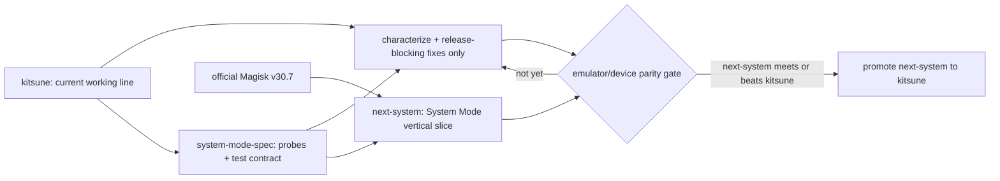

# KitsuneMagisk development roadmap

> Audit date: 2026-07-22 UTC
>
> Audited implementation baseline: `kitsune` after PR2 at `cf149fcf734539f6077cd6b349d9ffc2496c56ca`
>
> Upstream compared: `topjohnwu/Magisk` stable `v30.7` and `master` at `14ea5cfb4a5771c742f7c3fd1e685bdbfac7aa8c`
>
> Product charter: KitsuneMagisk exists primarily to provide persistent Magisk through **Direct-System/System Mode** on environments where normal boot-image installation is unavailable or impractical—especially commercial Android emulators—and secondarily to provide Kitsune-specific hiding and module behavior.

> Implementation progress updated: 2026-07-22 UTC. PR1 merged as [#22](https://github.com/Jordan231111/KitsuneMagisk/pull/22) (`b6c098d44`); PR2 merged as [#23](https://github.com/Jordan231111/KitsuneMagisk/pull/23) (`cf149fcf7`). PR3, PR4, and the PR4A lab hardening are implemented and locally verified. PR3's reusable characterization exit is met; full cross-vendor install/cold-boot/upgrade/uninstall qualification remains intentionally assigned to PR15.

> The explicit history-backed purpose, install-route, and divergence report is
> [`docs/faithfulness-audit.md`](docs/faithfulness-audit.md). It covers the complete reachable graph,
> catalogs all 171 fork-only commits, deeply reviews the security/boot/product changes, and records
> what must be preserved, restored, tested, or retired.

This is a prioritized, implementation-oriented TODO for resuming active development. It is intentionally more conservative than a normal app roadmap because this project installs privileged native code during boot, grants root, and modifies mount namespaces and SELinux policy. A mistake in install, boot, or rollback logic can make an emulator or device unbootable.

## Product identity: every purpose, in priority order

KitsuneMagisk is a Magisk distribution with one primary differentiator, not an unrelated rooting tool. The project should preserve these purposes without letting lower-priority work obscure the product gate:

| Priority | Purpose | Faithful scope |
|---|---|---|
| P0 | Persistent Direct-System/System Mode | Install and recover a Magisk-compatible root runtime on authorized emulators or controlled images where patching `boot`, `init_boot`, or `vendor_boot` is unavailable or impractical. This is the release-defining Kitsune feature. |
| P0 | Safe root lifecycle and recovery | Preflight, install, cold boot, upgrade, reinstall, uninstall, rollback, snapshot/stock restore, and truthful compatibility records. A root path that cannot be recovered is not supported. |
| P1 | Normal Magisk installation continuity | Keep upstream boot/init/vendor-boot patching for unlocked or otherwise controlled real devices and official AVDs. System Mode complements this path; it does not replace it. |
| P1 | Superuser policy | Provide the daemon, prompt/policy database, multiuser and mount-namespace behavior, logging, revoke/timeout behavior, and a usable manager. |
| P1 | Systemless customization platform | Preserve modules, magic mount, boot-stage scripts, BusyBox, `resetprop`, `magiskboot`, `magiskpolicy`, safe mode, OTA/addon survival where qualified, and clean removal. |
| P1 | Kitsune privacy and compatibility behavior | Maintain measured MagiskHide/DenyList/SuList semantics, hidden-manager recovery, SELinux-disabled compatibility, and a versioned external-Zygisk boundary. This is not a promise to bypass every detector or attestation service. |
| P1 | Broad emulator/device adapters | Support ARM64, ARM32, x86_64, and x86 through capability-driven in-guest or host-image adapters and exact runtime evidence. An all-ABI build is necessary but is never itself a support claim. |
| P2 | Maintainer and security-research platform | Make upstream changes auditable and enable authorized local fuzzing, crash analysis, vulnerability discovery, hardening, and regression derivation on disposable project-owned targets. Findings must become tests/fixes and, where applicable, responsible upstream disclosure. |

Non-goals are equally important. Kitsune must not claim to root arbitrary locked production devices without an authorized bootstrap, bootloader/image control, or a separately validated local privilege path. New exploit research is allowed in the owned lab, but release support must not silently depend on an undisclosed, vendor-version-specific vulnerability. The project also must not market universal root hiding, Play Integrity/attestation bypass, or architecture support that has only compiled and never run.

### Installation and maintenance invariants

- Normal Magisk file patch, boot/`init_boot`/`vendor_boot` Direct Install, inactive-slot, recovery, and
  emulator live-setup routes remain first-class. Direct-System is a separate explicit mode and must
  never silently replace or intercept them.
- A source-level route trace is not a physical-device support claim. Every advertised normal or
  System Mode route needs boot, root, uninstall, and stock/snapshot recovery evidence on its exact
  target.
- Dependencies should be the latest **compatible and evidenced** versions, not blindly the newest
  independent versions. Re-evaluate the latest official stable at the PR6 branch cut, inherit its
  coherent privileged stack, and isolate later security/major updates behind relevant all-ABI,
  boot-image, AVD, System Mode, and physical-recovery gates.
- Hiding and Zygisk are important product features, but root correctness and recoverability remain
  independent gates. No provider/UI label is accepted as proof of namespace behavior.

## Direct answer: why Kitsune says 31.0 when official Magisk is 30.7

Yes: the number was deliberately raised to force compatibility checks to pass. It does **not** mean this codebase contains a newer Magisk core than official Magisk.

The repository history is explicit:

- Commit [`78ff3756`](https://github.com/Jordan231111/KitsuneMagisk/commit/78ff375665d911773fce3bbaae4860a75b249989) changed `magisk.versionCode` from `27002` to `29999`. Its message says: “Pretend to be Magisk 29.9 to bypass validation for some modules.”
- Commit [`8e854f37`](https://github.com/Jordan231111/KitsuneMagisk/commit/8e854f378ebabe427f02d65615ddee57af5b53d0) changed it again from `29999` to `31000` and added `version=31.0-kitsune`. Its message says the number was changed “to enhance compatibility.”
- [`gradle.properties`](gradle.properties) currently supplies `magisk.versionCode=31000`.
- [`config.prop`](config.prop) currently supplies the user-visible `version=31.0-kitsune`.
- [`build.py`](build.py) uses the same `versionCode` in the Android APK and the native `MAGISK_VER_CODE`, so one inflated value currently serves two unrelated purposes: Android upgrade ordering and Magisk/module compatibility signaling.
- The official stable release is [Magisk v30.7](https://github.com/topjohnwu/Magisk/releases/tag/v30.7), with `versionCode=30700`.

The shipped `v31.0-25fa2159` APK was inspected during this audit. Its actual metadata is:

| Field | Shipped value |
|---|---|
| Application ID | `io.github.huskydg.magisk` |
| Android `versionCode` | `31000` |
| Android `versionName` | `31.0-kitsune` |
| Minimum SDK | 23 |
| Target/compile SDK | 34 / 34 |

There is also a release metadata bug: [`.github/workflows/android.yml`](.github/workflows/android.yml) claims the short commit hash is “the exact version string the APK reports,” but `config.prop` overrides the build script’s hash default. The APK reports `31.0-kitsune`, not `25fa2159`.

### The correct mental model

- `31000` is a fork compatibility/upgrade number chosen by prior maintainers.
- It is not an upstream version lineage claim backed by upstream source.
- Kitsune’s latest common ancestor with current Magisk is the February 2, 2024 canary commit `154121f3`.
- Relative to the audited PR2 baseline, stable `v30.7` has **858 upstream-only commits** and Kitsune has **171 fork-only commits**.
- Relative to current upstream `master`, the counts are **971 upstream-only commits** and **171 fork-only commits**.
- The audited snapshots differ across **763 files versus v30.7** and **837 files versus current master**. A blind merge or rebase is therefore a high-risk strategy.

## Executive recommendation

The product clarification changes the earlier recommendation. A completely new rewrite is **not** the fastest path to the next working System Mode build. The existing implementation already contains hard-won behavior for persistent binaries, init integration, SELinux, `/sbin`, OTA survival, uninstall, and commercial-emulator quirks. Throwing that knowledge away would be wasteful.

However, slowly merging roughly 858 upstream-only commits into the existing branch is also not the efficient long-term path. The most conflict-prone upstream work is in exactly the subsystems System Mode touches: init, sepolicy, MagiskSU, module mounts, scripts, and the manager. An in-place catch-up risks spending months resolving source conflicts without ever producing a demonstrably better emulator build.

Use a **two-track, test-first hybrid migration**:

1. Freeze automatic/stable publication, but keep the current branch named `kitsune` as the known-working System Mode reference while the port is evaluated.
2. Characterize the current System Mode behavior with a capability probe, fixtures, install/upgrade/uninstall tests, and actual LDPlayer/MuMu/Nox/BlueStacks evidence before refactoring it.
3. Apply only narrowly scoped fixes to current `kitsune`: the denylist migration, release containment, and any System Mode defect that blocks a build you still intend to ship. Do not modernize the old core twice; if current `kitsune` will not be released again, use it only for characterization and put the fix in `next-system`.
4. At the branch cut, re-check the latest official stable (currently `v30.7`), create `next-system`
   from that audited release, and port **System Mode first** as one end-to-end vertical slice. This is
   a forward-port of Kitsune’s product—not a clean-room rewrite of Magisk.
5. Reuse current upstream mechanisms wherever they replace custom code: its maintained SELinux stack, `magiskpolicy --load/--save/--magisk`, live emulator setup, boot-stage commands, module mounting, and current manager extraction code.
6. Time-box the v30.7 prototype. Do not promote it because it is newer; promote it only when it installs, cold-boots, upgrades, and uninstalls on the required emulator/device matrix at least as reliably as current `kitsune`.
7. Keep upstream `master` as an observation/backport source. Do not base the first System Mode recovery release on the larger post-v30.7 rewrite.
8. Port Hide/SuList, external-Zygisk integration, and early-mount after the new System Mode vertical slice works. They remain important, but they are not the branch-selection gate.

This gives two different “fastest” answers:

- **Fastest safe maintenance release, only if one is needed during the port:** fix the demonstrated current-branch blockers without attempting a broad upstream merge.
- **Fastest route to a maintainable product over several releases:** port the tested System Mode contract onto v30.7, then retire the old core only after parity.

The recommendation is therefore neither “rewrite everything” nor “keep patching the old core forever.” It preserves working product knowledge while creating a measured exit from the two-year upstream gap.

## Final-pass strategy: System Mode is the primary product

### Direct answer to the branch question

No: given the clarified goal, it would be too confident to claim that a new upstream-based branch is automatically faster. The current branch is almost certainly faster for producing the next **working** System Mode canary because the feature already exists there. The v30.7 branch is likely faster for reaching a maintainable multi-year architecture because it starts with hundreds of platform fixes already integrated. The hybrid plan lets measured results decide instead of betting the project on either assumption.

A v30.7 line also should not be described as a “clean rewrite.” Magisk itself is reused wholesale. The job is to forward-port one product slice—persistent System Mode—and replace obsolete custom glue with current upstream primitives. The app module split and C++-to-Rust changes still make this a real port, so the roadmap requires a prototype and parity gate before committing to it.

### What the existing feature actually contains

The original [`05289fb5`](https://github.com/Jordan231111/KitsuneMagisk/commit/05289fb56ca04f09e9a5ad417b8a1a456f8998bf) System Mode commit changed 17 files with 703 insertions and 58 deletions. It is not one installer button.

| Layer | Current implementation | Product responsibility |
|---|---|---|
| Manager entry point | `InstallViewModel`, `FlashViewModel`, `MagiskInstaller`, install layout | Expose Direct-System only when a bootstrap root exists and dispatch the operation |
| Recovery/ZIP entry point | `scripts/flash_script.sh`; filename substring `systemmagisk` or `SYSTEMMODE` | Bootstrap without the manager UI |
| Capability/remount layer | `manager.sh`: `is_rootfs`, bind mounts, remount checks, 20 MB write probe | Determine whether persistent system mutation is possible |
| Persistent payload | `/system/etc/init/magisk` | Store ABI binaries, policy tool, init helper, stub, config, and survival assets |
| Boot integration | generated `/system/etc/init/magisk.rc` or appended `bootanim.rc` | Start policy setup, tmpfs bootstrap, Magisk boot stages, and zygote-restart handling |
| Runtime tmpfs | custom `magisk --setup-sbin`, `mount_sbin`, applet links | Recreate normal Magisk runtime paths without a patched boot ramdisk |
| SELinux | live probe plus static policy-file patch using `magiskinit --patch-sepol` | Permit Magisk domains and boot-stage execution |
| Module/SU visibility | module-mount changes and later dynamic `/system/bin` MagiskSU work | Make Magisk tools visible while attempting to preserve hiding behavior |
| Persistence | `addon.d.sh` and copies under the system payload | Survive supported custom-ROM updates |
| Removal/recovery | `uninstaller.sh`, compressed backups, bootanim restoration | Remove persistent files and restore the selected policy/init file |

Important follow-up commits include:

| Commit | Relationship to System Mode | Disposition |
|---|---|---|
| `87d5c29d` | Reload module `sepolicy.rule` where possible | Re-evaluate against current upstream pre-init policy handling |
| `e2e83318` | Avoid permanent Magisk binary injection where possible | Preserve the behavior goal, not necessarily the old mount-tree implementation |
| `5d88f4c1` | Support many OEM/emulator partitions | Preserve as a tested partition-capability layer; upstream now has a redesigned Rust mount engine |
| `fb1fd3d6` | Dynamically expose MagiskSU under `/system/bin` | Treat as adjacent Hide/SuList behavior, not a prerequisite for persistence |
| `61926288` | Make the manager operation suspendable | Retain the coroutine/UI behavior on either branch |
| `dfb66f0a` | Fix `/sbin` creation on NoxPlayer Android 12 | Preserve as a regression case; replace hard-coded `/sbin` assumptions where possible |

This patch family is substantial enough that a blind cherry-pick will not work, but bounded enough that a behavior-driven forward-port is realistic.

### Strategy comparison

| Strategy | Time to next System Mode canary | Long-term upstream cost | Risk to already-working emulators | Recommendation |
|---|---|---|---|---|
| Slowly update the current branch in place | Short for small fixes; unpredictable for full catch-up | Highest; every old fork patch intersects newer architecture | Low initially, rising sharply during large merges | Use only for selective fixes while the port is evaluated |
| Start at v30.7 and recreate everything before testing | Long | Lower after completion | High because product behavior disappears until late | Do not do this |
| Port only System Mode onto v30.7, then add other features | Medium | Lowest practical long-term cost | Contained while current `kitsune` remains available for comparison | Build as `next-system`; do not promote before parity |
| Current-branch characterization plus v30.7 vertical slice | Shortest measured route to a maintainable result | Moderate during transition, then low | Low because the current build remains the comparison baseline | **Recommended** |

### Branch topology and decision gate



- `kitsune`: keep the existing branch name. It is the known-working comparison build, not a second long-term development project. Accept only tests and fixes required for a build you still intend to ship; do not merge upstream wholesale.
- `system-mode-spec`: tests, fixture descriptions, capability schema, diagnostic output, and expected install-state transitions. Keep this portable so both implementations run the same checks.
- `next-system`: after re-checking the official release list, branch from the latest audited stable
  (currently `v30.7` commit `e8a58776...`); first product PR is System Mode, not Hide, UI redesign,
  or unrelated dependency churn.
- `upstream-master`: read-only tracking/alert branch; no automatic merges.

No branch rename is required. After parity, `next-system` becomes the new `kitsune`; preserve the former implementation as a tag rather than maintaining two products indefinitely.

Time-box the first `next-system` spike to a fixed effort window, such as five to ten focused engineering days. The spike is successful only if it demonstrates an end-to-end cold boot on at least one representative writable commercial emulator; compiling the port is not success. If it cannot, record the precise blockers and fix only the narrow failing layer while current `kitsune` remains the reference.

### Define support by capabilities, not brand name alone

“All Android emulators” is a direction, not a testable compatibility promise. Vendors change Android versions, filesystems, hypervisors, root switches, system image formats, and update behavior without preserving an API for Kitsune. Publish support for exact emulator/version/image combinations and group them by installation capability.

| Tier | Required environment | Likely examples to qualify | Installation approach |
|---|---|---|---|
| A — in-guest writable system | Vendor bootstrap root, working ADB or manager root shell, writable ext4/root image, usable init RC import, policy patch path | LDPlayer builds with Root enabled; MuMu/Nox builds exposing Root and writable system | Manager or ADB-driven Direct-System installation |
| B — host-controlled image | ADB exists, but no supported in-guest root/remount; host can stop the VM, mount/rebuild/replace its Android image, and recover snapshots | BlueStacks is initially in this tier because official settings document ADB but not a supported root toggle | Host adapter that patches a copy of the image, never an undocumented in-place manager claim |
| C — real device/custom ROM | Unlocked/recoverable device, writable ext4 system or controlled image rebuild, compatible init/SELinux, known AVB state | Legacy devices, development devices, selected custom ROMs with `addon.d` | Recovery or host-image System Mode with full stock backup |
| D — immutable/verified layout | EROFS, active dm-verity/AVB, locked bootloader, inaccessible dynamic partition, or no recoverable write path | Many modern production devices and some emulator images | Explicitly unsupported for Direct-System; use normal boot/init_boot/vendor_boot patching when available |

Vendor documentation supports treating these as separate adapters:

- LDPlayer documents independent Root and ADB switches, both disabled by default in newer installs.
- MuMu exposes ADB tooling; MuMuPlayer for Mac even exposes separate `vmRootEnable` and `systemWritable` settings, proving that root and persistent system writability are different capabilities.
- Nox documents a Root toggle, and the Kitsune history contains a specific NoxPlayer Android 12 `/sbin` regression fix.
- BlueStacks officially documents ADB, but its public settings documentation does not expose an equivalent supported Root/System Writable switch. Do not advertise one-click in-guest System Mode there until a tested bootstrap or host-image adapter exists.

Root access alone is insufficient. A process can be UID 0 while `/system` remains EROFS, dm-verity protected, an overlay that disappears after restart, or part of an image that the emulator updater replaces.

### Adapter architecture for broad emulator coverage

Make “support more emulators” an adapter program rather than a growing collection of brand checks in one shell script.

- `generic-in-guest`: capability-driven install for any emulator/device with bootstrap root, persistent writable backing system, compatible init import, and supported policy path.
- `generic-host-image`: common stopped-image staging, manifest, digest, backup, and rollback interface.
- Vendor adapters: only the image discovery, stop/start/snapshot, image conversion, and ADB connection details that genuinely differ for BlueStacks, LDPlayer, MuMu, Nox, and later targets.
- Negative adapters: known layouts that must be rejected with a precise alternative, such as locked AVB or EROFS without a rebuild path.

Each adapter descriptor should include an immutable adapter schema version, maintainer, tested emulator versions, host OS, Android/API/ABI, image format, bootstrap method, required settings, detection rules, capabilities, install strategy, restore command, fixtures, and last-qualified date. Runtime detection must still confirm capabilities; a matching vendor property must never bypass safety checks.

Suggested expansion waves:

| Wave | Targets | Goal |
|---|---|---|
| 0 | Existing LDPlayer/MuMu/Nox configurations known to users | Preserve current value and turn field knowledge into regression tests |
| 1 | Current releases of LDPlayer, MuMuPlayer 12, Nox, and BlueStacks | Qualify the named product charter; build the first host adapter where needed |
| 2 | Android Studio AVD/Cuttlefish, Genymotion, MEmu, GameLoop, Waydroid, and other requested platforms | Reuse generic adapters; add vendor code only for demonstrated gaps |
| Continuous | New vendor versions and Android images | Run `doctor`, clone the prior qualification record, retest, and publish supported/experimental/unsupported status |

- [ ] Store public results in a generated `compatibility/emulators.json` plus readable table.
- [ ] Define status as `supported`, `experimental`, `blocked`, or `retired`; include exact reason and last passing version.
- [ ] Accept community qualification reports only with sanitized `doctor` output, full steps, image/emulator version, cold-boot evidence, and restore evidence.
- [ ] Never distribute vendor system images or modified commercial-emulator binaries from the project.
- [ ] Keep vendor-specific host patchers outside the Android APK when they require Windows/macOS filesystem or hypervisor access.

### Build `kitsune system-mode doctor` before broadening support

Add a read-mostly preflight command with human and `--json` output. The manager and host adapter must call the same implementation.

- [x] Record emulator vendor/product/version, Android API/build fingerprint, kernel, ABI, and boot ID without using those strings as the sole compatibility decision.
- [x] Report bootstrap transport: manager root, vendor `su`, root ADB, recovery, or host image.
- [x] Parse `/proc/self/mountinfo`; report the real source, filesystem, mount flags, device-mapper layer, and slot for `/`, `/system`, `/vendor`, `/odm`, `/product`, and `/system_ext`.
- [x] Detect EROFS, squashfs, shared-block ext4, overlayfs, dynamic partitions, dm-verity, and AVB/verified-boot state.
- [x] Distinguish “currently writable overlay” from “persistent backing image is writable.” Prove persistence only through a controlled probe plus cold boot, then remove the probe.
- [ ] Locate every candidate init import directory and verify whether a harmless marker RC is parsed on a disposable snapshot before installing root services.
- [x] Locate live, precompiled, monolithic, and split SELinux policy sources and their validation/hash metadata.
- [x] Verify at least 32 MiB of safe staging capacity rather than writing a 20 MB zero file directly into the final system target.
- [ ] Verify the system image/snapshot backup location, free space, digest, and restore command before the first mutation.
- [x] Return stable reason codes such as `NO_BOOTSTRAP_ROOT`, `READ_ONLY_FS`, `EROFS`, `VERITY_ACTIVE`, `INIT_IMPORT_UNPROVEN`, `SEPOLICY_UNSUPPORTED`, `NO_RECOVERY_PATH`, and `SUPPORTED`.
- [ ] Make the UI explain the failed capability and supported alternative; never show a generic “system is read-only” for every layout.

### Current System Mode correctness and safety audit

These findings do not mean the feature should be removed. They define the first high-yield work needed to make the project’s core purpose dependable.

#### Release-blocking issues

1. **No System Mode CI or maintained compatibility matrix.** The current API 23/29/35 AVD jobs test ramdisk/boot-style setup, not `direct_install_system`. The main product path has no automated assertion.
2. **The recovery path still requires a boot image before selecting System Mode.** `scripts/flash_script.sh` calls `find_boot_image` and aborts when none is found before reaching the `SYSTEMINSTALL` branch. This contradicts the use case where no usable boot-image path exists.
3. **Recovery activation depends on filename magic.** A ZIP/APK path containing `systemmagisk` silently changes installation mode. Replace this with an explicit visible option and confirmation.
4. **The live SELinux “probe” changes policy.** `magiskpolicy --live "permissive su"` is a state-changing security relaxation, not a harmless capability check. It remains active until reboot and does not prove that the complete persistent policy will load next boot.
5. **Static SELinux selection patches only the first matching file.** Modern split/precompiled policy selection can depend on platform/vendor inputs and matching hashes. A successful write to one candidate does not prove init will load it.
6. **Installation is not transactional.** The script creates/remounts paths, removes an earlier installation, writes payloads, patches policy, and edits init in sequence. A later failure can leave a mixed state. Backups live beside the modified files on the same image.
7. **Uninstall ownership is too broad.** Wildcards such as `*magisk*` under init directories can delete files not created by this exact installation. There is no versioned install manifest listing owned paths and original-file digests.
8. **The native context switch contains unsafe I/O.** `magisk --auto-selinux` writes `sizeof(string literal)`—including the terminating NUL—to `/proc/self/attr/current`, then prints a fixed buffer without using the read length or guaranteeing NUL termination. Replace it with the platform SELinux API or strict length-checked writes/reads and tests.
9. **`/sbin` is hard-coded as the runtime target.** The Nox Android 12 fix proves this is already a compatibility fault line. Current official emulator setup selects `/sbin` for legacy layouts and `/debug_ramdisk` when `/sbin` is absent.
10. **Android 6/API 23–24 persistence is unproven.** Init-RC generation is inside `if [ "$API" -gt 24 ]`; no equivalent persistent launch path is evident in that branch. Treat those APIs as unqualified until a cold-boot test proves otherwise.
11. **System Mode detection is heuristic.** Uninstall can infer System Mode from a missing boot-image SHA1. Persist an explicit mode/schema/install ID and refuse destructive cleanup when ownership cannot be proven.
12. **The UI checks root and an unpatched boot image, not actual System Mode capability.** It can offer an operation on immutable system layouts and cannot clearly express conversion, host-patch, unsupported, or already-installed states.

#### Required characterization and conditional current-branch fixes

- [x] Add characterization tests around the current behavior before changing it.
- [ ] Extract System Mode shell logic from the oversized manager resource into a separately linted/tested script with a versioned interface.
- [ ] Implement `doctor` and require a verified backup/snapshot plus explicit confirmation.
- [ ] Replace filename magic and SHA1 inference with an explicit `SYSTEM_MODE_SCHEMA` and install manifest.
- [ ] Stage all new files, calculate digests, validate policy/init output, and commit with a journal. On failure, roll back in reverse order and verify the original digests.
- [ ] Write backups outside the mutated image when possible; never claim recovery until a restore has been exercised.
- [ ] Replace the permissive live-policy probe and adopt current `magiskpolicy` load/save semantics.
- [ ] Replace wildcard uninstall with manifest-owned exact paths and hash-aware restoration.
- [ ] Fix and unit-test the `--auto-selinux` buffer/length behavior or remove the custom option in favor of a safer bootstrap.
- [ ] Make runtime tmpfs selection layout-aware using the maintained upstream live-setup logic.
- [ ] Separate System Mode from dynamic `/system/bin` SU visibility so persistence can be tested without Hide/SuList complexity.
- [ ] Add shell static analysis and failure-injection tests after every mutation boundary.

### v30.7 System Mode vertical-slice design

Start with current official code, but reuse current Kitsune behavior and fixtures:

- [ ] Add a dedicated `scripts/kitsune_system_install.sh`; do not paste another 300-line block into the manager shell resource.
- [ ] Derive tmpfs setup and boot-stage ordering from official v30.7 [`scripts/live_setup.sh`](https://github.com/topjohnwu/Magisk/blob/v30.7/scripts/live_setup.sh), which already supports API 23–36 and selects `/sbin` versus `/debug_ramdisk` by layout.
- [ ] Use v30.7 `magiskpolicy --load FILE --save FILE --magisk` or `--load-split` instead of retaining the custom `magiskinit --patch-sepol` command unless a regression fixture proves it necessary.
- [ ] Keep upstream native/Rust core unchanged for the first prototype wherever shell/init integration suffices. Every proposed native hook must name the missing upstream capability and include a failing test.
- [ ] Install one versioned launcher and one dedicated RC file where the target init demonstrably imports it; never append to `bootanim.rc` unless a specific legacy adapter requires and tests that fallback.
- [ ] Store an install manifest containing schema, product version, full source commit, upstream base, ABI payload digests, original file digests/metadata, selected policy strategy, init strategy, and adapter ID.
- [ ] Make installation states explicit: `PREFLIGHTED`, `STAGED`, `COMMITTED`, `BOOT_VERIFIED`, `ROLLBACK_REQUIRED`, and `UNINSTALLED`.
- [ ] Keep the vendor bootstrap root separate from Kitsune root. The test must prove Kitsune still starts after the vendor Root switch is disabled when the emulator supports doing so.
- [ ] Add a host-side adapter interface for emulators that cannot provide a writable in-guest system. It must operate on a stopped copy/snapshot and know how to validate/revert the vendor image format.
- [ ] Keep official built-in Zygisk during the first v30.7 System Mode proof. Removing it and introducing an external-provider contract is a later independent experiment.

### System Mode parity gate

`next-system` may replace current `kitsune` only when all of the following are true:

- [ ] The same `doctor --json` schema and test driver run against both branches.
- [ ] At least one current LDPlayer, MuMu, and Nox image completes install, three cold boots, upgrade, reinstall, module smoke, root policy smoke, uninstall, and snapshot restore.
- [ ] BlueStacks is either supported by a reproducible host/bootstrap adapter or explicitly listed as unsupported with the exact missing capability; ADB availability alone is not counted as support.
- [ ] One real writable-system/custom-ROM target completes the full recovery test if real-device System Mode remains advertised.
- [ ] One EROFS/AVB/dynamic-partition target is rejected before mutation with the correct reason and points to normal Magisk boot-image installation.
- [ ] Vendor root can be disabled after installation where that workflow is claimed.
- [ ] No boot depends on the manager APK remaining installed or `/data` being decrypted earlier than declared.
- [ ] SELinux remains enforcing where supported, the expected policy is actually loaded, and no unexplained AVC storm occurs.
- [ ] Failed installation at every injected failure point restores exact original digests and still cold-boots.
- [ ] Uninstall removes only manifest-owned files and restores policy/init metadata and digests.
- [ ] The v30.7 fork delta is smaller, more isolated, and easier to rebase than the equivalent current Kitsune subsystem, or any deliberate exception is documented.

## Current-state audit summary

| Area | Current evidence | Consequence |
|---|---|---|
| Upstream base | Common ancestor is `154121f3` from 2024-02-02 | The apparent `31.0` label hides a two-year architectural gap |
| Official stable | v30.7, released 2026-02-23 | Official code has Android 16 QPR2, current sepolicy, SU, boot, and Zygisk fixes absent here |
| Official master | `14ea5cfb`, 2026-04-22; 113 commits after v30.7 | Useful fixes exist, but master also contains a large app/UI/build rewrite |
| Latest Kitsune CI and local AVD evidence | [Run 26848644198](https://github.com/Jordan231111/KitsuneMagisk/actions/runs/26848644198) passed build plus API 23, 29, and 35 AVD jobs. The final [PR4A lab record](docs/system-mode/avd-lab-2026-07-22.md) captures local API 35 ARM64 debug/release patched-ramdisk boots, exact APK and restored-image hashes, while API 35 16 KiB/API 36 stock probes provide negative evidence. | Normal Magisk boot integration is evidenced on both CI x86_64 and Apple-Silicon ARM64; it still does not substitute for commercial-emulator System Mode qualification. |
| Local build | The pinned ONDK is installed; canonical debug/minified-release builds and Gradle debug native links pass for ARM64, ARM32, x86_64, and x86 on this Mac. Final testing found that Gradle's `NDK_DEBUG=1` omitted section GC and pulled dead ARMv7 unwind code; `Application.mk` now makes the canonical and Gradle link contracts explicit and the formerly failing ARMv7 path passes. | Preserve the exact toolchain/bootstrap checks so another maintainer can reproduce the result. |
| Local submodules | All current Kitsune submodules are initialized at their recorded gitlinks. A separate full recursive official-Magisk clone also checked out every current upstream submodule. | Recursive checkout remains a documented prerequisite; PR4B should automate reachability and pin drift. |
| Tests | The AVD runner installs, reboots, asks the app for root, and checks `su -c id`; PR3/PR4 add versioned host contracts, migration fixtures, rollback, randomized classifier/migration checks, and modern immutable negative lanes. | Hide/SuList/provider/module/early-mount and actual Direct-System install/upgrade coverage remain release blockers. |
| Primary product feature | System Mode originated in `05289fb5` and now spans manager UI, shell/recovery installation, native tmpfs setup, policy, init, persistence, and uninstall | It must be treated as the branch-selection and release-qualification gate, not an optional later experiment |
| System Mode test coverage | No current CI job invokes `direct_install_system`; the new doctor characterizes exact capabilities and refuses unsupported layouts, while `dfb66f0a` still records a NoxPlayer Android 12 `/sbin` regression fixed only through field knowledge. | Use the shared contract for the transactional installer and commercial-emulator lifecycle matrix; characterization is not install qualification. |
| Official reusable emulator logic | Magisk v30.7 `scripts/live_setup.sh` supports API 23–36 and handles legacy `/sbin` versus modern `/debug_ramdisk` runtime setup | The v30.7 port can replace several old custom primitives; it is a bounded vertical slice, not a from-scratch Magisk rewrite |
| PR checks | PR2 added pull-request checks, static/host/JVM tests, debug/release builds, API 23/29/35 AVD jobs, and an aggregate product gate. | Stable qualification is still broader, but ordinary code changes no longer lack a build/boot gate. |
| Update service | The inherited `1q23lyc45.github.io` channels are dead; PR4 now resolves every built-in channel to an explicit unavailable result without a request. Custom metadata requires HTTPS and cannot redirect to cleartext. | A project-owned, digest-validated service remains PR10; containment is complete for the current line. |
| Stub update | The inherited stub URL is dead; PR4 removes fallback metadata fetching and shows a project-service-unavailable path instead. | The stub fails honestly until PR10 supplies a project-owned artifact contract. |
| Release semantics | PR1/PR2 removed publication from ordinary pushes; the only publication path is an explicitly dispatched prerelease canary after the product gate. | Stable publication remains disabled until PR16. |
| Debug distribution | Debug APK is attached beside stable APK; debug native code grants ADB shell root automatically | The release description materially understates debug-build risk |
| Dependency audit | A fresh 2026-07-22 `cargo audit` found one medium vulnerability and five warnings: `rsa` 0.9.8 has the unfixed Marvin timing advisory; the reachable Kitsune use is local boot-image private-key signing, not a network signing oracle. Informational findings include vendored `cxx` 1.0.105's `let_cxx_string!` exception-safety defect (the macro has no production call site here), `rand` 0.8.5's custom-logger/thread-RNG edge case, and unmaintained build-time CLI dependencies. | Keep these as explicit pre-stable dispositions. Update `rand` and vendored `cxx` only in an isolated dependency PR with all-ABI/sign/verify/boot tests; track the no-fix RSA advisory without pretending it is patched. |
| Dependency automation | Dependabot watches Cargo only and has opened many untested major-version PRs | Gradle/actions are ignored, while Cargo updates create noise without validation |
| Documentation | PR1 replaced the sunset notice with an active README/status and this purpose-ordered roadmap. | Keep claims generated from exact compatibility evidence as the matrix grows. |
| SELinux dependency | `95a048f0` changed only the remote URL; the gitlink stayed on `8c6acc0d` from 2023 | Checkout was repaired, but no SELinux code was updated |
| Current official SELinux | Official Magisk stable/master use `topjohnwu/selinux` at `be1b39a6`, based on Android 16 QPR2-era AOSP plus Magisk compatibility patches | A maintained, directly compatible replacement exists; there is no need to invent the patch stack from scratch |
| Hide database change | `25fa2159` selected standard `denylist` without migration; PR4 now adds database v13, a verified immutable v12 backup, exact-SQL fixtures, conservative union, retained legacy/SuList rows, and an audit record. | Runtime provider semantics still need PR12 qualification, but the current-line data-loss/reactivation gap is contained transactionally. |
| External Zygisk contract | ReZygisk v1.0.0 removed its Kitsune/SuList adapter before `25fa2159`; current NeoZygisk recognizes the manager but queries only `denylist` | DenyList mode can interoperate, but current SuList interoperability is not established |
| Full fork-faithfulness audit | The complete 6,855-commit reachable graph was traversed, all 171 fork-only commits were catalogued, high-impact diffs were reviewed, and every install route was traced. | The [faithfulness report](docs/faithfulness-audit.md) confirms PR3/PR4 scope, preserves ordinary install as a first-class invariant, and assigns unresolved divergences to discrete later PRs. |

## Audit of every commit after “Last Commit”

### Scope and overall verdict

The exact reviewed range is:

```text
8e854f378ebabe427f02d65615ddee57af5b53d0..25fa2159fa2db2a9327fe69ee094520bd58cc04d
```

It contains ten commits. All ten diffs and their resulting tree were inspected. The final tree builds and passes the existing API 23/29/35 smoke jobs, but **the series is not ready to be treated as an optimal or release-quality patch set**. Two changes are valuable but incomplete (`95a048f0` and `25fa2159`), the LTO fix is a reasonable unverified workaround, four release-workflow commits lead to an unsafe final policy, two commits exist only to trigger Actions, and the documentation now contains claims that are false or obsolete.

The cumulative range is small enough to audit exhaustively: it changes five tracked paths with 90 insertions and four deletions. The review covered each commit diff, the final call sites and database schema, submodule ancestry/range-diff, the published release and Actions ordering, and current external-provider source. It does **not** substitute for the missing Windows reproduction, migration fixtures, SELinux policy corpus, or physical-device boot tests; those absences are findings, not assumed successes.

The ratings below judge the commits as engineering changes, not the intent behind them.

| Commit | Change | Verdict | Recommended disposition |
|---|---|---|---|
| [`95a048f0`](https://github.com/Jordan231111/KitsuneMagisk/commit/95a048f0196fb742bc5b396f40580594e12d8e58) | Repoint missing SELinux remote to LSPosed | **Correct emergency checkout repair; not an update** | `next-system` inherits the current official pin; update current `kitsune` only if another release will be made from it |
| [`b45016f0`](https://github.com/Jordan231111/KitsuneMagisk/commit/b45016f0d5a3f06587c7eef1a8524d5ec47edfd8) | Disable `init-ld` LTO everywhere | **Overbroad and immediately superseded** | Do not preserve as a standalone vNext patch |
| [`bb190797`](https://github.com/Jordan231111/KitsuneMagisk/commit/bb1907977220674567a8168ddc42b9773b8032d0) | Publish a rolling release on every push | **Unsafe release architecture** | Replace with separate unprivileged CI and approval-gated release workflows |
| [`8667b1d0`](https://github.com/Jordan231111/KitsuneMagisk/commit/8667b1d04328f8ec40088ed9364143c37ad6ecb7) | Add maintainer notes | **Useful idea, materially inaccurate now** | Rewrite rather than extend |
| [`713444f9`](https://github.com/Jordan231111/KitsuneMagisk/commit/713444f92d61b532161f57ed80ac100fd5d8b295) | Trigger initial build | **Empty commit** | Drop from a clean patch series; use `workflow_dispatch` |
| [`e501943d`](https://github.com/Jordan231111/KitsuneMagisk/commit/e501943dc10aa6957477095496e66dd2629eda81) | Change a comment to trigger/index workflow | **No product or CI behavior change** | Drop/squash; fix repository/workflow configuration directly |
| [`84ac3e58`](https://github.com/Jordan231111/KitsuneMagisk/commit/84ac3e58dfd6613db143867a1c1c1b087b820ef9) | Restrict the LTO workaround to Windows hosts | **Better, but not demonstrated or narrowly scoped** | Keep temporarily only with a reproducer and Windows CI; otherwise remove after toolchain update |
| [`7372980f`](https://github.com/Jordan231111/KitsuneMagisk/commit/7372980fbbb2c5afed7abc6dc6ce72e38def2bd3) | Turn every push into a full non-prerelease | **Release-policy regression** | Revert the behavior |
| [`70068d25`](https://github.com/Jordan231111/KitsuneMagisk/commit/70068d25d9f1b2900243fa9685794b6942188ad4) | Put short source SHA in release tag | **Partial build-identity improvement with a false claim** | Retain the source-SHA concept only in corrected build metadata |
| [`25fa2159`](https://github.com/Jordan231111/KitsuneMagisk/commit/25fa2159fa2db2a9327fe69ee094520bd58cc04d) | Make the default hide table `denylist` | **Correct interoperability fix for fresh/reselected setups; missing upgrade migration** | Keep the direction and add database/provider migration tests before calling it upgrade-safe |

Do not rewrite the already-published branch merely to make this history prettier. Make only release-blocking corrective commits on current `kitsune`; on `next-system`, recreate useful behavior as small, reviewed ports led by the System Mode contract.

### Commit-by-commit findings

#### `95a048f0` — SELinux mirror change

What it got right:

- The prior `1q23lyc45/selinux` URL now returns repository-not-found.
- LSPosed contains the exact pinned object `8c6acc0d7792cda5f203dfd8e94c633e9dbfdeae`.
- Because the gitlink did not change, the source tree used by the build remained byte-for-byte the same. This made recursive checkout work again without silently changing native code.

What it did not do:

- It did not update `libsepol` or `libselinux`.
- It did not establish that the old library supports current Android policy formats.
- It did not compare the mirror with current official Magisk’s SELinux fork.
- It moved availability from one third-party account to another instead of returning to the current official Magisk dependency.
- The LSPosed repository is not marked archived by GitHub as of this audit, but its `master` still ends at the October 2023 `8c6acc0d` source commit. “Not archived” therefore does not mean current.

Verdict: this was a sound emergency **mirror substitution**, but the commit title and maintainer note can be misread as a modern SELinux fix. The deep-dive and replacement plan are below.

#### `b45016f0` and `84ac3e58` — `init-ld` LTO workaround

What is reasonable:

- A host-specific `lld` access violation is a legitimate reason for a narrow workaround.
- `84ac3e58` correctly reduces the release impact: Linux CI keeps its prior LTO settings.
- `init-ld` is a small, single-source shared library, so the optimization benefit is likely small.

Problems and unproven assumptions:

- The original commit disabled LTO on every host and ABI even though the reported failure was Windows/aarch64.
- The final conditional tests only `OS=Windows_NT`; it still disables LTO for all four ABIs on Windows, not only `arm64-v8a`.
- “LTO is a no-op for a single-file lib” is too strong. Cross-translation-unit optimization is irrelevant with one source file, but link-time internalization/code generation can still affect output.
- There is no linked `lld` issue, crash log, minimal reproducer, toolchain build ID, or before/after binary comparison.
- The repository has no Windows CI job, so the only branch that exercises `-fno-lto` has not been tested by CI.
- No Actions run is associated with the intermediate `b45016f0` tree. The final Linux tree passed, which does not validate the Windows workaround.

TODO:

- [ ] Capture the failing Windows command, architecture, ONDK revision, `lld --version`, stack/error output, and whether Windows native, MSYS2, or WSL is involved.
- [ ] First test whether current ONDK removes the crash.
- [ ] If the workaround remains necessary, gate it on both Windows and `arm64-v8a` unless the other ABIs reproduce it.
- [ ] Add one Windows native build job or a documented manual release check.
- [ ] Compare `readelf`, exports, relocations, size, and a boot smoke test for LTO-on versus LTO-off `libinit-ld.so`.
- [ ] Replace the two-commit sequence with one documented workaround on `next-system`, or omit it if the current toolchain fixes the crash.

#### `bb190797`, `7372980f`, and `70068d25` — release automation

The final workflow publishes untested builds even though the source-SHA tag is better than a run-number tag:
- Release publication occurs inside the build job. The emulator jobs declare `needs: build`, so the APK is public **before** those tests run.
- In run `26848644198`, the release was published at `21:26:49Z`; the last emulator job completed at `21:30:39Z`.
- `prerelease: false` marks every push to `kitsune` as a full stable release.
- `fail_on_unmatched_files: false` permits a release step to succeed while expected files are missing.
- Debug manager and stub APKs are attached beside the release build. In this tree, debug native code gives ADB shell special automatic-root behavior; describing it only as “verbose logging” is unsafe.
- The release is created from a branch target (`targetCommitish: kitsune`) and an eight-character tag. The full immutable commit should also be embedded and verified.
- The body says the short hash is “the exact version this APK reports,” but the APK reports `31.0-kitsune` because tracked `config.prop` overrides `build.py`’s hash default.
- The published release body is actually “Store hide set in denylist table, not hidelist,” not the body present in the workflow. Release metadata generation is therefore not behaving as the source comments claim.
TODO:

- [ ] Move publication into a separate `release` job that needs every required build, unit, emulator, migration, and metadata job.
- [ ] Publish canaries as prereleases; publish stable only after the required product tests pass.
- [ ] Set missing expected files to fail the job.
- [ ] Never place debug APKs on the stable release. If debug builds are retained as expiring CI artifacts, label the automatic ADB-root behavior prominently.
- [ ] Verify tag, full commit, APK `versionName`/`versionCode`, native version, update JSON, and hash before publication.
- [ ] Promote the already-tested artifact; do not rebuild after approval and call the new bytes the same release.

#### `8667b1d0` — maintainer documentation

The document is useful as a starting point, but these statements must change:

- “Built-in Zygisk was removed upstream” is ambiguous and false if “upstream” means official Magisk. It was removed from this fork lineage; official Magisk still includes Zygisk.
- “Use ReZygisk” is no longer a sufficient compatibility statement. ReZygisk v1.0.0 explicitly [removed its Kitsune adapter](https://github.com/PerformanC/ReZygisk/commit/333d423cde1a959958d9fce380bd017cf6c1cf64), including SuList handling and a Kitsune clean-namespace timing workaround.
- Current NeoZygisk recognizes the `kitsune` manager identity, but its Magisk path [queries only the `denylist` table](https://github.com/JingMatrix/NeoZygisk/blob/master/zygiskd/src/root_impl/magisk.rs); it has no demonstrated SuList inversion contract.
- The SELinux text describes a checkout fix as if it were sufficient ongoing maintenance.
- The release/tag text repeats the false “APK reports the short hash” claim.
- The debug APK description omits automatic ADB-shell root behavior.
- It does not disclose the dead updater endpoints or unsupported-device boundaries.

TODO:

- [ ] Replace `MAINTAINER.md` with an evidence-based project status document or fold it into active contributor/security documentation.
- [ ] Say “this fork” or name the exact lineage instead of using ambiguous “upstream.”
- [ ] Publish a tested provider/version/mode compatibility matrix rather than a blanket ReZygisk recommendation.
- [ ] Link every security or compatibility assertion to a test, issue, or exact source commit.

#### `713444f9` and `e501943d` — CI trigger commits

- `713444f9` has no file changes.
- `e501943d` changes only a workflow comment.
- `workflow_dispatch` already existed, so an empty/content-free source commit was not necessary as the long-term trigger mechanism.
- Actions runs begin appearing at `e501943d`; earlier commits in the batch have no independently attributable workflow run.

These commits are harmless at runtime but reduce history signal. Use manual dispatch and keep source commits tied to source behavior.

#### `25fa2159` — `hidelist` to `denylist`

This change is **not purely wrong**. The compatibility observation is real: external providers use the standard Magisk `denylist` table, so the change explains why a fresh or reselected emulator configuration works. The defect is the missing upgrade migration and the unqualified SuList claim, not the decision to converge normal hide mode on `denylist`.

Concrete correctness problems:

1. `native/src/core/db.cpp` remains at `DB_VERSION 12`; there is no migration.
2. Existing Kitsune users can have MagiskHide selections in `hidelist`. After the update, the rows remain stored but the daemon/UI reads `denylist`, so those selections become inactive until migrated or reselected.
3. `denylist` has existed since the old official schema. A user can have stale rows there. The change can unexpectedly reactivate them.
4. `hidelist` is still created, so two tables remain with no declared source of truth or synchronization rule.
5. The CLI/help/UI still call the feature MagiskHide/HideList while the storage contract silently became official DenyList.
6. The commit comment says SuList remains compatible because external providers read `sulist`. Current ReZygisk v1.0.0 removed that code on May 10, 2026, before this June 2 commit. Current NeoZygisk contains no `sulist` query.
7. SuList is a whitelist/inverted visibility model; it cannot safely be represented by simply pointing a blacklist consumer at `denylist`.
8. There are no tests for fresh install, upgrade, downgrade, both tables populated, isolated processes, secondary users, or provider/SuList combinations.

The fact that API 23/29/35 smoke CI passes says nothing about this change: those jobs never add/list/remove a target, never install an external Zygisk provider, and explicitly skip Zygisk behavior testing.

TODO before releasing the behavior as migration-safe:

- [x] Keep `denylist` as the intended canonical table for normal hide mode, but do not represent the pointer-only commit as a complete upgrade migration.
- [ ] Define one canonical table and document the semantics for Hide, DenyList, and SuList separately.
- [x] Bump the database schema version and migrate in one transaction.
- [x] Back up the old rows or retain a rollback-safe legacy table until the migration has shipped successfully.
- [x] Define conflict behavior when both `hidelist` and `denylist` contain data. A security-conservative union hides more apps but can break functionality; silently choosing either table is not acceptable.
- [ ] Add fixtures for: empty DB, `hidelist` only, `denylist` only, overlapping/divergent tables, SuList enabled, malformed rows, and downgrade.
- [ ] After migration, make all app, CLI, daemon, receiver, and provider-facing operations use the same contract.
- [x] Do not claim current SuList support for ReZygisk/NeoZygisk. Either add a versioned adapter with the provider project, maintain a reviewed provider patch, or mark the combination unsupported.
- [ ] Detect provider name/version and expose it in diagnostics; do not infer compatibility merely from the presence of a module.
- [ ] Test add/remove/list, process prefix matching, isolated services, shared UIDs, work profiles/secondary users, reboot persistence, and package uninstall.
- [ ] Test what each target sees: Magisk mounts, module mounts, `su`, Zygisk modules, manager package, sockets, and properties.

### Corrective order for this ten-commit series

1. Disable automatic non-prerelease publication immediately.
2. Withdraw the blanket debug/ReZygisk claims and mark the existing release experimental.
3. Complete the `denylist` change with a DB migration/provider matrix; do not ship the pointer-only state as a normal release.
4. Inherit current SELinux on v30.7; update current `kitsune` separately only if it will ship again.
5. Split CI from release and run the required product tests before publication.
6. Rewrite maintainer documentation from the resulting tested state.
7. Re-evaluate the Windows LTO workaround after the ONDK update; keep it only with evidence.

## SELinux deep dive: what Kitsune has and how to update it safely

### Direct answer

Your concern is justified, with one important correction:

- Kitsune is pinned to old SELinux userspace code, but the LSPosed repository is not marked archived.
- Commit `95a048f0` changed only where Git fetched the existing object. The gitlink before and after is exactly `8c6acc0d7792cda5f203dfd8e94c633e9dbfdeae`, authored October 27, 2023.
- The old tree is customized for Magisk. It is not plain AOSP SELinux.
- Those customizations were not unique unpublished work from `1q23lyc45`. The pinned commit was committed by topjohnwu and came from the Magisk SELinux patch stack.
- Current official Magisk again uses [`topjohnwu/selinux`](https://github.com/topjohnwu/Magisk/blob/master/.gitmodules) and pins `be1b39a657fee7faacfae548b75cb53302043a01` in both v30.7 and current master.
- That current tree is the best available ready-made “latest custom SELinux for Magisk”: it rebases the same compatibility intent onto Android 16 QPR2-era sources. Official Magisk’s [`dd379890`](https://github.com/topjohnwu/Magisk/commit/dd3798905f1ec75afa71701ff03a5af3be762c83) describes the update as Android 16 QPR2 support.

Do **not** start by taking arbitrary SELinuxProject `main` or AOSP `main` and hoping it is Magisk-compatible. Use the exact source and build manifest that official Magisk has already integrated, then add Kitsune-specific changes only if a test proves they are needed.

### Exact ancestry and patch preservation

The old LSPosed tip and current topjohnwu tip share ancestor `a772618e5ca2ef248304c29fc7b47a7b27f9f920`. From that point, the old tree added five Magisk patches. `git range-diff` maps all five to the current tree:

| Purpose | Old commit | Current equivalent | Status |
|---|---|---|---|
| Prebuild the generated CIL lexer | `5ad2e49f` | `607ea523` | Same patch intent |
| Read Android M-era policy encoding | `afd26f48` | `8db96f26` | Forward-ported and updated for current structures |
| Export functions used by `magiskpolicy` | `3ac09a23` | `9517608c` | Same patch intent |
| Tolerate unknown permissions in real Android CIL | `7fe34740` | `b90649df` | Same patch intent |
| Skip strict `policydb_validate` after reading | `8c6acc0d` | `743913e6` | Same three-line validation bypass |
| Preserve Android-specific policy flags while rewriting | absent | `be1b39a6` | New compatibility patch |

The current tree is based on AOSP’s `25Q4-release` snapshot and is hundreds of upstream commits ahead of the old tree. It includes Android 16 QPR2 format support and many parser/robustness fixes absent from the 2023 pin. Examples in the intervening history include bounds checks, integer-overflow fixes, a `sepol_av_to_string` buffer-overflow fix, double-free/resource-leak fixes, and newer policy capabilities.

The current tree still deliberately skips final `policydb_validate`. That is not an accidental omission in Kitsune: [the old patch](https://github.com/LSPosed/selinux/commit/8c6acc0d7792cda5f203dfd8e94c633e9dbfdeae) says strict validation rejected real device policies, and topjohnwu reapplied it to the new base. This trades parser hardening for OEM compatibility and deserves explicit tests; blindly re-enabling it can make some devices unbootable.

### Compatibility comparison

| Concern | Current Kitsune pin `8c6acc0d` | Official pin `be1b39a6` | What Kitsune should do |
|---|---|---|---|
| Source epoch | 2023 | Android 16 QPR2-era AOSP/25Q4 | Move to official pin |
| Android M policy compatibility | Custom patch | Forward-ported custom patch | Preserve via official pin |
| Unknown-permission tolerance | Custom revert | Same custom revert | Preserve via official pin |
| Strict final validation | Disabled | Disabled | Preserve initially; harden experimentally behind tests |
| Android-specific config bits | Older handling | Explicitly copied/preserved | Use current implementation |
| `cil_deny.c` | File absent | Required by current CIL sources | Add it to legacy `Android.mk` source list |
| Existing 122 listed SELinux sources | Present | All still present | Source-path migration is feasible |
| Full current Magisk sepolicy engine | No | Yes | Prefer v30.7 baseline rather than library-only transplant |
| Hyphenated rule identifiers | Old C++ statement parser | Fixed on current Magisk master in `14ea5cfb` | Backport only after parser architecture review, or inherit through upstream base |

Updating only the submodule modernizes the library/parser core. It does **not** magically port every change in `native/src/sepolicy`, `native/src/init`, policy rules, boot integration, or Rust statement parser. That is another reason the clean v30.7 base is safer than indefinitely modernizing the current tree piecemeal.

### Recommended path A — inherit official v30.7 SELinux in `next-system`

This is the preferred solution.

- [ ] Create `next-system` directly from official `v30.7`.
- [ ] Keep its `.gitmodules`, SELinux gitlink `be1b39a6`, `native/src/external/Android.mk`, `native/src/sepolicy`, and init policy integration together as one tested baseline.
- [ ] Prove the unmodified base boots before porting Kitsune features.
- [ ] Port MagiskHide/SuList and early-mount around the current policy API; do not transplant the old SELinux library/build files into the new base.
- [ ] Consider current-master `14ea5cfb` (hyphenated identifier parsing) as a small explicit backport only if a regression test demonstrates the bug on v30.7.
- [ ] Track later official Magisk SELinux gitlink changes with an alert PR, never an unattended auto-merge.

### Path B — optional isolated modern-libsepol PR for current `kitsune`

Use this only if another release will be made from current `kitsune` while `next-system` is being qualified. Otherwise, do not duplicate the dependency work. Do not mix it with ONDK, Rust, Hide, or release-pipeline changes.

Proposed mechanical change:

```sh
git switch -c fix/current-modern-libsepol
git submodule set-url native/src/external/selinux https://github.com/topjohnwu/selinux.git
git submodule sync -- native/src/external/selinux
git submodule update --init native/src/external/selinux
git -C native/src/external/selinux fetch origin be1b39a657fee7faacfae548b75cb53302043a01
git -C native/src/external/selinux checkout --detach be1b39a657fee7faacfae548b75cb53302043a01
```

Then:

- [ ] Change the gitlink from `8c6acc0d` to `be1b39a6`.
- [ ] Add `selinux/libsepol/cil/src/cil_deny.c` beside `cil_copy_ast.c` in `native/src/external/Android.mk`, matching official Magisk’s [`b70192ca`](https://github.com/topjohnwu/Magisk/commit/b70192ca3e984291afe7cddea83a149f72a66205).
- [ ] Keep ONDK r27.1 for the first comparison build so failures can be attributed to one dependency change.
- [ ] Build release and debug for all four current ABIs.
- [ ] Run `magiskpolicy` load/apply/save/reload tests against the policy corpus below.
- [ ] Compare exported symbols and unresolved references for `libsepol.a`/`magiskpolicy`.
- [ ] Compare old/new `magiskpolicy --magisk` output semantically, not only by file hash; serialization order may change.
- [ ] Test boot-image patch and two reboots on every gated emulator/device.
- [ ] Confirm Android M compatibility with a real old binary policy; the existence of the forward-port alone is not proof.
- [ ] Confirm Android 16 QPR2 policy read/write on a matching system image or captured policy corpus.
- [ ] Fail the PR if any policy is partially written or a parser warning is ignored without an allowlisted reason.

The current build compiles unused `libselinux.a` and `libpcre2.a` for every ABI even though no active native target links them. Current official Magisk removed these targets. Handle that as a separate reviewable cleanup:

- [ ] Produce link maps proving neither archive is consumed.
- [ ] Remove the unused `libselinux`/PCRE targets and PCRE submodule only after release/debug/all-ABI comparison builds.
- [ ] Measure build-time and output differences; do not bundle this cleanup with the first gitlink update.

### Path C — maintain a Kitsune SELinux fork only if necessary

Do not fork merely to change the owner name in `.gitmodules`. A fork creates a security-sensitive maintenance obligation. Create one only if Kitsune needs a reviewed change that topjohnwu’s tree does not carry.

- [ ] Fork `topjohnwu/selinux`, not the stale LSPosed tip and not unpinned AOSP `main`.
- [ ] Add remotes named `upstream-magisk` and `aosp`; protect the release branch in your fork.
- [ ] Start the first branch/tag at exact reviewed commit `be1b39a6`, for example `kitsune/android16-qpr2-1`.
- [ ] Keep each Magisk compatibility patch as a separate commit. Do not squash the patch queue into an opaque source dump.
- [ ] Record the AOSP base commit, AOSP branch, Magisk patch range, compiler/ONDK, generated-file process, and source manifest in a machine-readable file.
- [ ] Use `git range-diff` whenever rebasing the patch queue to a newer AOSP release snapshot.
- [ ] Use maintained tags and pin Kitsune’s submodule to an immutable commit, never to a moving branch.
- [ ] Mirror/archive the pinned git objects so a deleted GitHub account cannot break reproducible checkout again.
- [ ] Add a scheduled job that reports when official Magisk changes its SELinux gitlink; it may open an issue/PR but must not auto-merge native parser changes.
- [ ] Run upstream libsepol tests plus Kitsune’s Android policy corpus with ASan/UBSan on a host build where feasible.
- [ ] Fuzz policy loading, CIL compilation, rule parsing, and save/reload round trips.
- [ ] Document every deviation from `topjohnwu/selinux` with threat model, affected policy format/device, regression input, and planned retirement condition.

If you want to improve the validation bypass, do it incrementally:

- [ ] Preserve compatibility behavior first so the dependency update is not mixed with a boot-risk semantic change.
- [ ] Add strict and compatibility parser modes in the fork.
- [ ] In CI, require all known-good AOSP policies to pass strict validation and catalog OEM policies that require compatibility mode.
- [ ] If production attempts strict-first/fallback, re-read into a fresh policy database after strict failure; never continue with partially initialized state.
- [ ] Log the exact validation failure and policy fingerprint locally without uploading device-identifying data by default.
- [ ] Keep fallback narrowly scoped and measurable rather than globally assuming all validation is useless.

### Required SELinux policy corpus

Keep only redistributable/sanitized fixtures in the repository; store device-derived fixtures privately if licensing or identifying data is uncertain.

| Policy class | Why it is required | Minimum assertion |
|---|---|---|
| Android 6 / policy version 30 | Exercises the custom Android M xperm compatibility patch | Load, patch, save, reload without changing unrelated AVTAB entries |
| Android 8–10 legacy/monolithic | Covers old ramdisk and SAR devices | Magisk rules apply and device reaches enforcing boot |
| Android 11–15 split CIL | Exercises platform/vendor/product/system_ext mappings | Compile split policy, apply module rules, preserve mappings |
| Samsung policy | OEM-invalid/extended constructs motivated relaxed validation | Known policy succeeds without corrupt output |
| MediaTek policy | Common vendor divergence and boot partition variants | Patch and boot with no new AVC storm |
| AOSP Android 16 QPR2 | Exercises the format that current Magisk explicitly updated for | Read/write new flags/capabilities and boot enforcing |
| GSI with missing product/system_ext mappings | Exercises current AOSP compatibility handling | Compilation succeeds with correct role/type behavior |
| SELinux-disabled/Waydroid | Preserves a Kitsune differentiator | No crash, null policy write, or false enforcing assumption |
| Malformed/truncated/fuzz inputs | Tests failure containment | Clean nonzero failure, no output replacement, no ASan/UBSan finding |
| Module `sepolicy.rule` corpus | Protects the public extension surface | Valid rules apply; invalid/empty/comment/hyphen cases report deterministic errors |

### SELinux release gate

- [ ] Dependency URL and gitlink match the reviewed source record.
- [ ] All custom patches have range-diff evidence against the prior patch stack.
- [ ] Source-list generation/check catches newly required or removed `.c` files.
- [ ] All policy corpus cases pass load, patch, save, reload, and semantic comparison.
- [ ] No parser crash, partial output, or silent ignored rule occurs.
- [ ] API 23, 29, 35, and Android 16 QPR2 emulator/device gates pass twice from cold boot.
- [ ] At least one Samsung and one MediaTek physical recovery-tested device pass before stable promotion.
- [ ] Release diagnostics expose the exact SELinux gitlink and policy engine version.

## Priority and effort notation

- **P0 — release blocker:** do before publishing another APK as stable or recommended.
- **P1 — recovery baseline:** required for a credible vNext release candidate.
- **P2 — later reliability:** worthwhile cleanup after the System Mode baseline works.
- **P3 — enhancement:** useful, but should not delay a working System Mode release.
- Effort uses relative sizes: **S** (contained), **M** (multi-file), **L** (architectural), **XL** (multi-phase/device-dependent).
- The numbered PR sequence, including the inserted 4A/4B foundation steps, is the authoritative execution order. P0/P1/P2 sections and the highest-yield summary are specifications and cross-checks for those PRs, not separate backlogs.

---

# P0 — release blockers

Signing-key changes, secret management, attestations, and other release-infrastructure work are deliberately outside this roadmap. Simple artifact digests remain only where they are part of functional updater validation. Use the existing development build setup while making the product work.

## P0.1 Take ownership of every update and download endpoint — L

### Current breakage

The app and stub still trust infrastructure belonging to prior maintainers:

- `https://1q23lyc45.github.io/stable.json`
- `https://1q23lyc45.github.io/beta.json`
- `https://1q23lyc45.github.io/canary.json`
- `https://1q23lyc45.github.io/debug.json`
- `https://huskydg.github.io/download/magisk/31.0-kitsune.apk`

All returned HTTP 404 during this audit. The live code references them in `Const.kt`, `ServiceLocator.kt`, `stub/build.gradle.kts`, and `DownloadActivity.java`.

### TODO

- [ ] Move all default update metadata and APK URLs under an account/organization controlled by the current project.
- [ ] Update `SOURCE_CODE_URL`, channel base URLs, stub URLs, changelog URLs, support links, and any manager home-screen links.
- [ ] Prefer immutable GitHub Release asset URLs for APKs, with a project-owned small metadata endpoint for channel discovery.
- [ ] Define one versioned update schema containing at minimum:
  - product name and channel;
  - product version and monotonic Android build code;
  - upstream base tag and commit;
  - exact source commit;
  - APK URL, byte length, and SHA-256 digest;
  - minimum supported Android/API and migration notes;
  - release notes URL;
  - schema version.
- [ ] Verify the APK digest before install or dynamic load.
- [ ] Make the stub use the same metadata schema as the full app.
- [ ] Make missing, malformed, downgraded, or mismatched metadata fail closed with an actionable error.
- [ ] Add tests for HTTP 404, invalid JSON, truncated APK, digest mismatch, rollback metadata, and channel switching.
- [ ] Stop treating an arbitrary custom-channel response as trusted without a strong warning and digest validation.
- [ ] Add an automated post-release probe that downloads metadata and each asset exactly as the installed app/stub would.

### Acceptance criteria

- Stable, beta/candidate, canary, and debug URLs resolve and are controlled by this project.
- A released stub can download the matching full manager in a clean emulator.
- Tampered metadata or APK bytes are rejected before install/load.
- An older metadata `versionCode` cannot silently roll a user back.

## P0.2 Separate product version, Android upgrade code, and Magisk compatibility — L

### Problem

One integer currently means all of the following:

1. Android APK update ordering;
2. app-versus-daemon equality checks;
3. module-facing `MAGISK_VER_CODE`;
4. fork release branding.

Those meanings conflict. Android requires future app updates to use a higher `versionCode` than the installed `31000`; it does **not** require the user-visible version name to say Magisk 31. Android’s official guidance explicitly separates monotonically increasing [`versionCode` from user-visible `versionName`](https://developer.android.com/studio/publish/versioning).

### TODO

- [ ] Introduce separate build fields, for example:
  - `kitsune.versionName` — fork release name such as `0.1.0-rc.1`;
  - `kitsune.appVersionCode` — monotonically increasing Android code, starting above `31000` for an in-place path;
  - `magisk.baseVersion` — official base, e.g. `30.7`;
  - `magisk.baseCommit` — `e8a58776...`;
  - `magisk.compatVersionCode` — a deliberately tested module/API compatibility value;
  - `kitsune.commit` and `kitsune.channel` — source identity.
- [ ] Stop deriving release tags from the misleading `v31.0` label. Use a fork namespace such as `kitsune-v0.1.0` and `kitsune-canary-<sha>`.
- [ ] Generate a single build-info file consumed by Kotlin, C++/Rust, shell scripts, release metadata, and CI so they cannot disagree.
- [ ] Add `magisk --version-json` or an equivalent diagnostic showing every field above.
- [ ] Replace app/daemon equality checks based only on the overloaded code with an explicit protocol/build ID.
- [ ] Document exactly what `MAGISK_VER_CODE` promises to modules.
- [ ] Add capability detection for Kitsune-specific features, for example `magisk --features` with stable identifiers such as:
  - `kitsune.sulist.v1`
  - `kitsune.early-mount.v2`
  - `kitsune.external-zygisk-contract.v1`
- [ ] Update module guidance to test capabilities instead of assuming a fake future Magisk version.
- [ ] If legacy modules force a temporary compatibility value, label it as a compatibility epoch, list the tested modules, and give it an expiration/migration plan.
- [ ] Add a CI assertion comparing APK manifest metadata, native CLI output, generated update JSON, release tag, and source commit.

### Acceptance criteria

- The UI no longer implies the fork is newer than official Magisk merely because its Android build code is higher.
- Existing users receive a monotonic Android update when that migration path is intended.
- Release tag, APK, daemon, stub, and update JSON all report the same source commit and product version.
- Module compatibility is backed by a matrix or a capability flag, not an unqualified `31.0` claim.

## P0.3 Establish the two-track System Mode migration and preserve history — L

### TODO

- [ ] Add a read-only `upstream` remote for `https://github.com/topjohnwu/Magisk.git`.
- [ ] Keep the branch named `kitsune` and add an annotated tag documenting the known-working audit state. It is the comparison baseline during the port, not a second long-term product line.
- [ ] Create a portable `system-mode-spec` test/capability contract from the current behavior before refactoring it.
- [ ] Create `next-system` from official stable `v30.7` (`e8a58776...`).
- [ ] Create an automated `upstream-master` tracking ref/branch without merging it into releases automatically.
- [ ] Record the base tag and commit in build output and release metadata.
- [ ] Build a port ledger with one row per fork-only behavior:
  - originating commit(s);
  - user-visible purpose;
  - current files/subsystems;
  - whether upstream now implements it;
  - keep/reimplement/drop decision;
  - tests required;
  - owner/status.
- [ ] Use `git range-diff`, path-specific diffs, and behavior tests to understand patches; do not assume an old C++ patch can be cherry-picked into a subsystem now implemented in Rust.
- [ ] On current `kitsune`, accept only tests and fixes needed for a build that will actually ship; do not attempt a rolling merge of the full upstream delta.
- [ ] On `next-system`, port Direct-System first and keep the base’s built-in Zygisk until System Mode reaches parity.
- [ ] Keep the first vNext candidate on upstream stable. Selectively backport only small, understood post-v30.7 fixes such as the current master’s sepolicy hyphenated-identifier parser fix if tests demonstrate relevance.
- [ ] Apply the parity gate in the final-pass System Mode section. Branch age or diff size alone cannot promote `next-system`.
- [ ] Define a recurring upstream intake process: review new stable tags promptly, run the compatibility suite, update the ledger, and publish the exact delta.

### Acceptance criteria

- The current branch has characterization tests before behavior changes.
- The new branch builds before System Mode is added, then passes the same System Mode contract as current `kitsune`.
- `git diff v30.7...next-system` contains only intentional fork work.
- Every carried patch has a purpose, test, and upstream status.
- The release branch is selected through emulator/device parity evidence, not an assumption that either old or new is faster.
- Upstream updates never arrive as an unreviewed bulk merge into the release branch.

## P0.4 Make CI prove the product before publication — M

### Audited starting problems

- The workflow runs on pushes to `dev` and `kitsune`, but not on pull requests.
- Current Dependabot PRs have no checks.
- Every `kitsune` push becomes a non-prerelease GitHub Release.

PR1 and PR2 contain these immediate failures. The extended matrix and final stable-release workflow remain part of PR16.

### TODO

- [x] Add `pull_request` CI that builds the project and runs the relevant tests.
- [ ] Split workflows:
  - `ci.yml`: build, static checks, unit tests, and emulator smoke tests; never publishes;
  - `nightly.yml`: extended emulator/device matrix and upstream comparison;
  - `release.yml`: manual dispatch after the required product tests pass.
- [x] Add concurrency groups and cancel superseded PR runs.
- [x] Keep ordinary builds as Actions artifacts; publish only an explicitly requested, tested canary marked as prerelease. Do not label each commit as stable.
- [x] Keep stable publication disabled until PR16 implements and passes all product release gates.
- [x] Do not attach the debug APK to a release. The documentation also warns that ADB shell receives root automatically in this fork’s debug native code.
- [ ] Publish a SHA-256 checksum for the exact tested APK.
- [x] Ensure the canary APK is byte-for-byte the artifact that passed tests; do not rebuild after approval with different inputs.
- [ ] Add a release smoke job that installs the downloaded GitHub Release asset, not just the pre-upload workspace copy.
- [x] Do not run unreviewed public-PR code on the personal machine used for commercial-emulator qualification; current PR CI uses only disposable GitHub-hosted runners.

### Acceptance criteria

- Every code change has compile/static/unit results before it is treated as releasable.
- Stable releases are manual/protected; canaries are visibly prerelease.
- Debug-root behavior is never presented merely as “verbose logging.”

## P0.5 Confirm dependency blockers on the v30.7 base — S

`cargo audit --file native/src/Cargo.lock` currently reports:

Do not repair the old dependency graph package by package. Re-run the audit on the pristine v30.7 `next-system` baseline and fix only findings that remain there or demonstrably block the System Mode port.

| Package | Current | Finding | Action |
|---|---:|---|---|
| `cxx` | 1.0.105 | [RUSTSEC-2026-0202](https://rustsec.org/advisories/RUSTSEC-2026-0202.html), unsound; fixed in 1.0.195 | Upgrade to at least 1.0.195 and test every Rust/C++ bridge |
| `rand` | 0.8.5 | [RUSTSEC-2026-0097](https://rustsec.org/advisories/RUSTSEC-2026-0097.html), conditional unsoundness; fixed in 0.8.6 | Update resolved dependency and lockfile |
| `atty` | 0.2.14 | Unsound/unmaintained warnings through old protobuf tooling | Replace/update the dependency chain rather than suppress indefinitely |
| `ansi_term` | 0.12.1 | Unmaintained through old `clap`/`pb-rs` chain | Replace/update generator/tooling chain |

### TODO

- [ ] Re-run `cargo audit` on the clean upstream baseline and after each port.
- [ ] Add `cargo audit` as required CI with a reviewed, narrowly scoped deny/ignore policy.
- [ ] Do not merge the current major-version Dependabot PR queue blindly; most should be superseded by the upstream-baseline work.
- [ ] Run compilation, native unit tests, boot-image corpus tests, and AVD smoke tests for every dependency group.

## P0.6 Make System Mode non-destructive and testable — XL

The detailed audit, adapter tiers, and architecture are in “Final-pass strategy: System Mode is the primary product.” The minimum release-blocking slice is:

- [ ] Stop calling the current System Mode stable until install, cold-boot, upgrade, uninstall, and rollback are exercised on named emulator versions.
- [ ] Add `kitsune system-mode doctor --json` and reject unsupported EROFS/AVB/dm-verity/dynamic-partition layouts before mutation.
- [ ] Remove the recovery path’s unconditional boot-image requirement for an explicitly selected System Mode operation.
- [ ] Remove filename-substring activation and require an explicit mode plus destructive-operation confirmation.
- [ ] Replace the state-changing `permissive su` policy probe.
- [ ] Fix or remove the unsafe `--auto-selinux` context-switch I/O.
- [ ] Introduce an external backup, install manifest, staged commit, failure journal, exact-path uninstall, and verified rollback.
- [ ] Make `/sbin` versus `/debug_ramdisk` selection layout-aware.
- [ ] Prove or drop the API 23–24 System Mode claim.
- [ ] Establish disposable snapshots and a repeatable LDPlayer/MuMu/Nox lab before the next System Mode canary.

### Acceptance criteria

- Every advertised emulator/version has a reproducible bootstrap guide and machine-readable test record.
- Unsupported immutable layouts fail before persistent writes.
- Every injected install failure restores the original snapshot/file digests and cold-boots.
- Install, update, reinstall, and uninstall are idempotent and manifest-owned.
- A System Mode canary is never promoted solely because generic AVD `su -c id` passed.

---

# P1 — recovery baseline and feature convergence

## P1.1 Inherit upstream platform work instead of recreating it — XL

The biggest long-term yield comes from using current upstream implementations underneath the System Mode product. Relevant official release work includes:

- [v28.0](https://github.com/topjohnwu/Magisk/releases/tag/v28.0): 16 KiB pages, improved boot-image/device detection, rewritten 2SI logic, pre-init detection, denylist without Zygisk, resetprop changes, large Samsung images, `action.sh`, vendor boot, and PROCA handling.
- [v28.1](https://github.com/topjohnwu/Magisk/releases/tag/v28.1): Android <8 fixes, MTK Samsung support, 2SI regression fix, and `overlay.d` access fix.
- [v29.0](https://github.com/topjohnwu/Magisk/releases/tag/v29.0): major native refactoring, module deletion nodes, sepolicy redesign, and better TTY/PTY support.
- [v30.1–v30.4](https://github.com/topjohnwu/Magisk/releases): module-mount fixes, root capability controls, overlayfs/`.replace` fixes, `vendor_boot` installation, Android 16 QPR2 sepolicy, and MagiskSU fixes.
- [v30.6](https://github.com/topjohnwu/Magisk/releases/tag/v30.6): a bootloop-causing init change was reverted.
- [v30.7](https://github.com/topjohnwu/Magisk/releases/tag/v30.7): Android 16 QPR2 sepolicy/Zygisk support, pre-init improvements, MagiskSU capability behavior, LZMA detection, and magiskboot CLI fixes.

### TODO

- [ ] Build and boot pristine v30.7 under this project’s CI before adding fork behavior.
- [ ] Confirm API 23 remains supported after adopting upstream Java 21, Gradle 9.3, AGP 9.0.1, target SDK 36, compile SDK 36.1, stub version 40, and ONDK 29.
- [ ] Keep upstream native/Rust architecture intact. Reimplement Kitsune hooks at stable extension points.
- [ ] Retain upstream tests for modules, sepolicy, SU, Zygisk, 16 KiB pages, and boot images.
- [ ] Compare current upstream `master` after each stable-baseline milestone; backport only fixes with a reproduced bug or platform requirement.

## P1.2 Port and qualify the System Mode vertical slice — XL

This is the first product feature on `next-system`, and the last gate before deciding whether v30.7 should become the main line.

### TODO

- [ ] Land the shared capability schema, install-state model, fixtures, and host test driver without changing runtime behavior.
- [ ] Run the suite against current `kitsune` to capture the known-good and known-bad baseline.
- [ ] Port a minimal persistent launcher/RC, runtime tmpfs bootstrap, policy strategy, payload manifest, transaction, and uninstall onto unmodified v30.7 core.
- [ ] Prefer upstream `live_setup.sh`, current `magiskpolicy`, boot-stage commands, module engine, and manager extraction APIs over old custom native switches.
- [ ] Add native hooks only after a failing target proves shell/init integration cannot provide the required behavior.
- [ ] Implement Tier A in-guest install first; add Tier B host-image adapters independently so BlueStacks-specific work cannot destabilize writable-system emulators.
- [ ] Test the exact current and next APK on the same clean snapshots and record installer duration, reboot count, boot success, AVCs, root/module behavior, rollback success, and residual files.
- [ ] Complete the parity gate before starting Hide/SuList or external-Zygisk changes on `next-system`.

### Acceptance criteria

- At least LDPlayer, MuMu, and Nox representative builds meet the full parity gate.
- BlueStacks has either a reproducible adapter or an honest, reason-coded unsupported result.
- The port has no unexplained custom changes to Magisk init/sepolicy/module core.
- Future stable Magisk rebases can rerun the same System Mode suite without rewriting it.

## P1.3 Decide the Zygisk architecture explicitly — L

Current Kitsune removed built-in Zygisk and tells users to install ReZygisk/NeoZygisk. Official Magisk v30.7 actively maintains built-in Zygisk, including Android 16 QPR2 and additional device support. This is a product architecture decision, not a minor patch.

The current provider state narrows the safe claims considerably. ReZygisk v1.0.0 removed its Kitsune-specific adapter, SuList support, and Kitsune namespace-timing workaround. NeoZygisk still recognizes the Kitsune manager package, but its Magisk adapter queries only the standard `denylist`. Neither current project establishes a supported SuList contract. Treat each provider/version as a pinned, tested external dependency rather than interpreting a successful module load as compatibility.

### Options

| Option | Benefits | Costs/risks |
|---|---|---|
| Keep official built-in Zygisk | Lowest maintenance; upstream compatibility/tests; current Android support | Changes current Kitsune product direction; interaction with MagiskHide/SuList must be designed |
| Remove built-in Zygisk and define one external-provider contract | Preserves current direction and potentially smaller core | Every upstream update needs a removal/adapter patch; external version compatibility becomes a release dependency |
| Support both via build flavor | Lets users choose | Doubles important test/release combinations and support complexity |

### Recommendation

Keep upstream built-in Zygisk intact through the System Mode parity gate so the baseline remains testable. Then write an ADR and implement the selected architecture as a contained patch. If external-only remains the goal, support one documented contract first; do not claim compatibility with multiple providers until each is tested.

### TODO

- [ ] Write `docs/adr/0001-zygisk-provider.md` with threat model, compatibility goals, and ownership.
- [ ] Define the database/CLI contract external providers may consume.
- [ ] Publish a provider matrix containing exact provider commit/version, minimum claimed Magisk protocol, selected database table, DenyList behavior, SuList behavior, Android/API range, and tested Zygisk modules.
- [ ] Pin the tested external provider source/version in CI and release notes; fail diagnostics clearly when an untested major version is installed.
- [ ] Coordinate a versioned SuList adapter with the selected provider project if SuList is a product requirement. Do not infer it from that provider's DenyList support.
- [ ] Add module compatibility tests, not just a “provider starts” check.
- [ ] Test provider missing, disabled, outdated, crash-looping, and upgrade cases.
- [ ] Ensure MagiskHide/SuList still behaves predictably with provider on and off.

## P1.4 Reimplement MagiskHide/SuList as a secondary differentiator — XL

After System Mode, this is the clearest feature that distinguishes Kitsune. It spans:

- `native/src/core/deny/`
- database settings/tables (`magiskhide`, `hidelist`, `denylist`, `sulist`)
- package/process discovery
- ptrace and zygote handling
- mount reversion
- Kotlin settings and list UI
- external Zygisk-provider integration

The latest commit changes the default table pointer from `hidelist` to `denylist`, but it does not add an explicit migration for existing selections. The UI still says “hidelist” in places, and settings/CLI names mix MagiskHide and DenyList terminology.

### TODO

- [x] On current `kitsune`, keep the `denylist` direction and add an explicit transactional migration before another normal release.
- [ ] Specify semantics before porting:
  - What exactly is hidden/unmounted?
  - Is the list deny-by-default or allow-by-default in SuList mode?
  - Which processes inherit package selection?
  - What happens for isolated services, app zygotes, shared UIDs, work profiles, and secondary users?
  - What changes require process kill or reboot?
- [x] Bump `DB_VERSION` and define a transactional migration from both `hidelist` and `denylist` into the chosen canonical table.
- [x] Preserve existing user selections; never silently drop a hide list after upgrade.
- [x] Define and test the conflict rule when both legacy tables contain divergent rows; make the migration backup/rollback behavior explicit.
- [ ] Resolve terminology across DB, native CLI, Kotlin config, UI strings, logs, and docs.
- [ ] Port against upstream’s current denylist/package tracking implementation instead of copying the 2024 C++ subsystem wholesale.
- [ ] Keep the SELinux-disabled/Waydroid behavior from `c30ba784`, but add tests proving the relaxed context check cannot be reached when SELinux is active.
- [ ] Audit ptrace lifecycle, PID reuse, zygote restart, app-zygote detection, locking, signal handling, and failure cleanup.
- [ ] Make external-provider table reads a versioned contract rather than a comment in `utils.cpp`.
- [ ] Add CLI commands that return structured, stable exit codes/output for add/remove/list/status/mode.
- [ ] Add UI handling for provider unavailable, kernel without mount namespaces, unsupported SELinux state, and partial failures.
- [ ] Add a diagnostic export that redacts private app data but reports mode, provider version, schema version, and failed operations.

### Required tests

- [ ] Fresh DB, legacy `hidelist` DB, current `denylist` DB, and `sulist` DB migration.
- [ ] Add/remove/list idempotency and duplicate handling.
- [ ] Regular app, isolated service, shared UID, app zygote, work profile, secondary user.
- [ ] Process already running versus launched after list change.
- [ ] SELinux enforcing, permissive, and unavailable.
- [ ] Kernel with and without mount namespaces.
- [ ] ReZygisk/provider enabled, disabled, absent, and mismatched version.
- [ ] Every provider/version claimed in the published compatibility matrix, including a negative test proving SuList is rejected or labeled unsupported where no adapter exists.
- [ ] Reboot persistence and rollback to previous release.
- [ ] Proof that non-selected apps retain expected module/root behavior.

## P1.5 Port early-mount as a versioned module API — L

Kitsune currently supports global and per-module `early-mount.d`, early files, and init RC injection through `native/src/init`, `native/src/core/module.cpp`, constants, and `scripts/util_functions.sh`.

### TODO

- [ ] Document the boot stage, available partitions, SELinux context, file ownership, ordering, and failure policy.
- [ ] Decide whether arbitrary `init.rc` injection remains supported; if so, define validation and collision rules.
- [ ] Reimplement on current upstream pre-init/module abstractions.
- [ ] Version the module API (`early-mount-v2` or successor) and expose capability detection.
- [ ] Make ordering deterministic across modules.
- [ ] Detect conflicting targets and report the responsible modules.
- [ ] Ensure a broken early-mount module can be disabled through safe mode/remove-modules recovery.
- [ ] Test A-only, A/B, SAR, 2SI, `init_boot`, `vendor_boot`, read-only partitions, overlayfs, and missing pre-init storage.
- [ ] Add boot-time budgets and logs so a module cannot silently stall boot indefinitely.

## P1.6 Triage every other fork feature: keep, use upstream, or retire — L

| Feature/patch family | Current assessment | Recommended action |
|---|---|---|
| `action.sh` module action | Official upstream has supported this since v28 | Use upstream implementation; port only Kitsune UI differences with tests |
| Systemless file/folder deletion | Official upstream now implements blank deletion nodes | Drop legacy implementation and verify behavior against upstream tests |
| 16 KiB page support | Official upstream supports and tests it | Use upstream; remove old disable/revert history from active delta |
| P-521 magiskboot support | Present upstream | Use upstream |
| `vendor_boot` install/boot handling | Present and maintained upstream | Use upstream |
| SELinux-disabled/Waydroid zygote detection | Kitsune-specific useful compatibility | Reimplement narrowly with enforcing/permissive/disabled tests |
| `boot-completed.sh` per module | Potentially useful but expands module execution surface | Keep only with documented ordering, timeout, and safe-mode behavior |
| Direct install into system partition | Primary product purpose with high boot/data-loss risk and no current automated coverage | Characterize current `kitsune`; port first to `next-system`; release only for exact qualified capability tiers |
| Dynamic MagiskSU injection into `/system/bin` | Adjacent detection/compatibility patch with broad mount impact; not required merely to persist System Mode | Decouple from the installer; keep only where Hide/SuList tests prove the need |
| Random socket/package hiding changes | Cat-and-mouse behavior with maintenance/security cost | Threat-model and benchmark; do not preserve merely because it exists |
| Debug ADB shell auto-root | Convenient for CI, dangerous for users | Keep only in explicit internal test flavor; do not publish as normal debug download |
| Built-in Zygisk removal | Architectural choice | Handle only through the Zygisk ADR above |
| App obfuscation disabled | GPL compliance does not require disabling normal optimizer/obfuscator | Re-enable safe shrinking/optimization; publish source/mappings as required; do not rely on obscurity for trust |

## P1.7 Modernize the Android manager from the upstream app base — XL

Current app stack is compile/target SDK 34, Java 17, AGP 8.5.1, Gradle 8.9, libsu 5.2.2, Retrofit 2.9, Room 2.6.1, and older AndroidX components. Upstream v30.7 uses compile SDK 36.1, target 36, Java 21, AGP 9.0.1, Gradle 9.3, Kotlin 2.3, libsu 6, Retrofit 3, Room 2.8, and a modularized app layout.

### TODO

- [ ] Start from upstream app modules; do not incrementally drag the old single-module UI through every missing migration first.
- [ ] Port the System Mode preflight/result/recovery screen as soon as its CLI/schema are stable; port Hide/SuList screens after their core contract is stable.
- [ ] Remove stale prior-maintainer and official-Magisk URLs or label them explicitly as upstream references.
- [ ] Preserve accessibility, dynamic type, locale, dark theme, and Android 13+ per-app language support.
- [ ] Add app unit tests for update parsing, version display, settings migrations, and DB migrations.
- [ ] Add instrumentation tests for root request, hide-list editing, module action, update failure, and hidden-manager flow.
- [ ] Test hidden/repackaged manager behavior only after the normal System Mode manager flow works.
- [ ] Remove `fallbackToDestructiveMigration()` where it can erase meaningful user data; write explicit migrations.
- [ ] Ensure target-SDK changes do not break background downloads, package install, notifications, storage, or user-initiated jobs.

## P1.8 Make the build reproducible and developer-friendly — L

### TODO

- [ ] Add a bootstrap document/script that checks:
  - recursive submodules;
  - supported Python/JDK versions;
  - Android SDK/build-tools/platforms;
  - exact ONDK release;
  - required host tools;
  - available disk space.
- [ ] Pin and verify the SHA-256 of ONDK archives before extraction. Current `build.py` downloads and extracts an archive without an in-repo expected digest.
- [ ] Use safe archive extraction that rejects absolute paths and `..` traversal.
- [ ] Verify Gradle distribution checksum and wrapper JAR.
- [ ] Pin submodule commits and automatically alert when their remotes disappear or commits become unreachable.
- [ ] Add `abiList` support from current upstream so development builds can select one ABI while releases still build all supported ABIs.
- [ ] Make `./build.py doctor` print actionable missing prerequisites without starting a build.
- [ ] Support Linux CI and macOS developer setup; document Windows only if it is continuously tested.
- [ ] Add a `config.prop.sample` that is sufficient for a debug build.
- [ ] Generate build metadata deterministically and set `SOURCE_DATE_EPOCH` where practical.
- [ ] Compare two clean builds and document any unavoidable nondeterminism.

### Acceptance criteria

- A clean documented checkout can produce a debug APK without hand-editing tracked files.
- Tool downloads are integrity-checked.
- CI and a second clean environment produce equivalent metadata and explain any binary differences.

## P1.9 Build an authorized vulnerability-research and upstream-differential lab — L

The existing roadmap fuzzes SELinux inputs, but that is only one privileged attack surface. Add a general program for finding new defects and determining whether they are merely crashes, local denial of service, privilege-boundary violations, or useful authorized bootstrap paths. Do this as engineering infrastructure, not as an unreviewed collection of exploit scripts.

**Manual audit result (2026-07-22 UTC):** a temporary full, all-branch/all-tag recursive clone of official Magisk checked out every current submodule and confirmed `v30.7` (`e8a58776f1d7bdf852072ad0baa6eceb9a1e4aac`) as the latest stable release and `14ea5cfb4a5771c742f7c3fd1e685bdbfac7aa8c` as the observed `master` tip. The common ancestor remains `154121f3`; the PR2 baseline is 171 fork-only commits versus 858 stable-only or 971 master-only commits. Stable remains the sensible port base. Master remains an observation lane because it adds extensive post-v30.7 app/build architecture changes and its build script requires Python 3.12+ syntax rather than this Mac's default Python 3.11. PR4B converts this one-time audit into a reproducible ledger and targeted fuzz/sanitizer jobs.

### Full upstream intelligence

- [ ] Maintain read-only remotes for official stable tags and `master`; use a full recursive clone for scheduled audits so deleted/renamed files, submodule history, and patch ancestry remain visible. Do not vendor the temporary clone into this repository.
- [ ] Generate a machine-readable upstream ledger containing the stable/master commits, common ancestor, left/right commit counts, changed-path ownership, submodule pins, toolchain/API/ABI changes, and a semantic disposition for every security- or compatibility-sensitive upstream change.
- [ ] Diff release-to-release and stable-to-master changes in `native/src/{boot,init,core,sepolicy}`, installer scripts, manager/stub networking, database code, and build/download tooling. Review security fixes even when no CVE or “security” label was assigned.
- [ ] Use `git range-diff`, focused tests, and small backports. Never infer that a clean textual cherry-pick is behaviorally safe, and never auto-merge privileged parser/init/policy changes.
- [ ] Record current upstream realities explicitly: v30.7 is the stable port base; current master is an observation lane, has extensive post-v30.7 app/build work, and requires a newer Python parser than this Mac's default Python 3.11.
- [ ] Re-resolve “latest stable” at every baseline branch cut and release candidate. A recorded commit
  is immutable evidence for one audit, not permission to ignore a newer official stable.

### Local discovery and derivation lanes

- [ ] Inventory trust boundaries and input ownership for boot/vendor/init image parsing, CPIO/compression/DTB handling, SELinux binary/CIL/rule parsing, daemon sockets and request framing, MagiskSU policy transitions, SQLite migrations, module ZIP/metadata/scripts, update metadata and redirects, mountinfo/device-mapper parsing, and host-emulator adapters.
- [ ] Add deterministic malformed-input corpora plus coverage-guided fuzz targets where practical. Run C/C++ host targets with ASan/UBSan, Rust targets with `cargo fuzz`/sanitizers or Miri where supported, Python contract code with randomized/property tests, and SQLite migrations with interruption/fault injection.
- [ ] Exercise allocation, short read/write, `fsync`, rename, ENOSPC, EROFS, permission, process-death, and reboot boundaries. A parser that rejects malformed input but leaves a partial boot image/database/install is still a failure.
- [ ] Run exploitability derivation only on repository-owned code and disposable, authorized images: reproduce, minimize, identify the reached privilege/context, prove the boundary with the least-powerful test case, fix it, and retain a non-weaponized regression. Use port 16384 only for read-only work until a verified snapshot/restore tuple exists.
- [ ] Keep architecture-specific corpora and runtime lanes for ARM64, ARM32, x86_64, and x86. Add RISC-V only with a runnable Android target; upstream compilation support alone is not evidence.
- [ ] Triage every finding with affected versions, preconditions, impact, reproducibility, fix commit, regression test, and disclosure status. Coordinate privately with upstream/vendor maintainers when a finding affects code or products beyond this fork.
- [ ] Threat-model the current global `ENFORCE_SIGNATURE=0` fork change. Restore official package
  signature enforcement on `next-system`; permit any hidden-manager exception only if it is narrow,
  identity-bound, and covered by replacement/upgrade/recovery abuse tests.

### Dependency and toolchain inventory

- [ ] Generate a machine-readable inventory/SBOM for Gradle plugins and libraries, Cargo crates,
  vendored native code, submodule gitlinks, GitHub Actions, JDK/Python/Rust, SDK/build-tools, NDK/ONDK,
  licenses, advisories, and deliberate version holds.
- [ ] Compare the inventory to the chosen official stable and current official `master`; classify each
  delta as inherit with the baseline, security backport, compatible update, major migration, or
  evidence-backed hold.
- [ ] Update security fixes and low-risk compatible dependencies in focused PRs. Gate native/Rust
  changes with four-ABI build/link, malformed-input corpora, boot-image patch/unpatch/sign/verify,
  and at least API 23/29/modern boots; add System Mode and physical recovery tests when the changed
  component reaches those paths.
- [ ] Never treat a raised compile/target SDK or a dependency-only green build as proof of newer
  Android support. Record `init_boot`, `vendor_boot`, GKI, SAR/2SI, policy format, 16 KiB page, AVB,
  module, root-policy, and recovery evidence separately.

### Acceptance criteria

- A clean host can regenerate the upstream ledger without modifying either source tree.
- Every fuzz crash is deduplicated, minimized, and either fixed with a regression, documented as unreachable, or tracked with an owner and disclosure state.
- Any proposed vulnerability-assisted bootstrap names the exact owned target/version and recovery path and remains separate from generic System Mode support.
- No stable release depends on a crash, race, or vendor vulnerability that is absent from its public capability and support record.

---

# Verification strategy required before a release candidate

## Test layers

### Fast checks on every PR

- [ ] `git diff --check`
- [ ] YAML/action validation (`actionlint`)
- [ ] Shell parsing plus `shellcheck`
- [ ] Python formatting/lint/type checks and unit tests for build helpers
- [ ] Kotlin/Java compile, lint, and unit tests
- [ ] Rust `fmt`, `clippy`, native unit tests, and `cargo audit`
- [ ] C/C++ warnings treated as errors for changed code where feasible
- [ ] Generated metadata consistency test
- [ ] APK manifest, version, and endpoint-policy inspection

### PR emulator smoke matrix

| API | Boot model/purpose | Required smoke |
|---:|---|---|
| 23 | Oldest supported, legacy rootfs | patch, boot, manager setup, root request, module mount, uninstall/recovery |
| 29 | 2SI transition | patch, boot, root, module mount, hide-list smoke |
| 35 or 36 | Modern stable Android | all above plus target-SDK/update/provider smoke |

Run debug on all PRs. Run release on at least one representative API so release-only optimization failures cannot hide.

These official AVD lanes validate Magisk’s normal boot/init integration. They do not validate persistent commercial-emulator System Mode and cannot substitute for the matrix below.

### Nightly/full emulator matrix

- [ ] API 23: legacy rootfs without Treble.
- [ ] API 26: legacy rootfs with Treble; restore coverage removed from current CI.
- [ ] API 28: legacy system-as-root behavior.
- [ ] API 29: 2SI.
- [ ] API 34: current fork target behavior and upgrade regression.
- [ ] API 35/36: modern stable behavior.
- [ ] API 37 preview/current only on the upstream-tracking lane until production support is declared.
- [ ] 16 KiB page-size image where available.
- [ ] At least x86_64 plus an arm64 lane; do not assume compiling four ABIs proves runtime behavior.

One-off local PR4A evidence now covers API 35 ARM64 debug/release normal-Magisk boot integration, a true 16,384-byte API 35 negative image, and a 4,096-byte API 36/Android 16 negative image. The boxes remain open until these lanes are repeatable CI/nightly jobs rather than one maintainer's local run.

### Commercial-emulator System Mode matrix

Maintain disposable golden instances. Record the exact emulator version, Android image/version, ABI translation mode, image digest, host OS/hypervisor, Root/ADB/System Writable settings, filesystem, SELinux state, adapter, and expected result. Never update a golden image in place without retaining the previous one.

| Target family | Initial lanes | Bootstrap expectation | Required result before claiming support |
|---|---|---|---|
| LDPlayer | Current LDPlayer 9 x64 plus one older still-supported Android image | Vendor Root and local ADB enabled; prove persistent backing writability separately | In-guest install, vendor Root off where possible, three cold boots, module/root/update/uninstall/restore |
| MuMu | MuMuPlayer 12 Windows; MuMuPlayer Mac only if a maintainer can own that lane | Root/ADB; explicit `systemWritable` where the vendor surface exposes it | Same full flow; record whether writes survive emulator and host restart |
| Nox | Current Android 9 and Android 12-capable images where available | Vendor Root; exercise the historical `/sbin` regression | Same full flow plus `/sbin`/`/debug_ramdisk` strategy assertion |
| BlueStacks | Nougat/Pie/Android 11 instance families selected from current supported images | Official ADB is not assumed to be root; expect host/bootstrap adapter until proven otherwise | Reproducible image/snapshot adapter and restore, or an honest reason-coded unsupported result |
| Negative immutable target | At least one EROFS or active AVB/dm-verity image | Any available root shell | Installer refuses before persistent mutation and recommends the correct alternative |

- [ ] Drive in-guest operations over ADB with a common harness and collect the logs needed to diagnose product failures.
- [ ] Test host reboot as well as Android cold boot; some emulator writes persist only within a running/snapshot layer.
- [ ] Test clone/multi-instance behavior so install IDs, socket paths, databases, and update state do not leak between instances.
- [ ] Test emulator self-update/image replacement. Document whether Kitsune survives, automatically reapplies from a trusted host package, or requires reinstall.
- [ ] Validate x86, x86_64, ARM translation, and pure ARM lanes only where the vendor actually provides them.
- [ ] Do not run untrusted public-PR code on the commercial-emulator host. Use manual approval and reset the machine/instances to a verified clean snapshot after every job.

### Physical-device qualification

Emulators cannot validate the riskiest boot paths. Maintain a small, documented physical matrix:

- [ ] Pixel/GKI with `init_boot`.
- [ ] Device using `vendor_boot` ramdisk.
- [ ] Samsung device/firmware path, including large image handling and PROCA behavior.
- [ ] MTK device.
- [ ] Legacy A-only/SAR device if support remains promised.
- [ ] Device or environment with SELinux permissive/disabled (including Waydroid if supported).
- [ ] Work profile/secondary user device for Hide/SuList.
- [ ] Recovery procedure tested with stock images and module-disable/safe-mode path.

### Feature assertions missing from current CI

- [ ] System Mode `doctor`, install, three cold boots, upgrade, reinstall, failure rollback, uninstall, vendor-root-off, and host-snapshot restore.
- [ ] Exact install-manifest ownership and a negative immutable-system refusal before mutation.
- [ ] Install, enable, disable, update, remove, and rollback a normal module.
- [ ] `.replace` and systemless deletion behavior.
- [ ] `action.sh`, `boot-completed.sh`, and early-mount behavior.
- [ ] MagiskHide/DenyList and SuList selection plus actual mount visibility checks.
- [ ] External/built-in Zygisk provider and a representative module.
- [ ] Root policy prompt, allow, deny, revoke, timeout, shared UID, and multiuser.
- [ ] Hidden manager creation, upgrade, and recovery.
- [ ] Update metadata success/failure/tampering/downgrade cases.
- [ ] Install to `boot`, `init_boot`, and `vendor_boot` as supported.
- [ ] Patch/unpatch a maintained boot-image corpus with byte/structure assertions.
- [ ] Uninstall restores a bootable stock state.

---

# P2 — later reliability and maintainability

## P2.1 Improve native failure containment — L

- [ ] Add structured error propagation around mount, ptrace, sepolicy, DB, and process operations.
- [ ] Audit ignored return values and broad exception/error suppression in build and runtime code.
- [ ] Add timeouts and cleanup for zygote tracing and module scripts.
- [ ] Ensure partial early-mount/direct-system operations roll back or leave a recoverable marker.
- [ ] Add watchdog-safe behavior and avoid boot loops after one failed experimental operation.
- [ ] Make logs useful while avoiding unnecessary installed-app lists or sensitive paths in release diagnostics.

## P2.2 Measure instead of guessing at hiding changes — M

- [ ] Define supported behavior without promising universal banking/game/Play Integrity bypass.
- [ ] Maintain detection regression tests that inspect mount visibility, process state, properties, package identity, and known exposed files.
- [ ] Record performance cost of ptrace/package rescans and zygote restarts.
- [ ] Remove hiding patches that add broad risk without a repeatable benefit.
- [ ] Separate root management correctness from the endless detection/bypass layer so the former remains maintainable.

## P2.3 Repository governance and contributor usability — M

- [x] Replace the root sunset README with an active README and status page.
- [x] Clearly state this is an unofficial fork and link official Magisk without claiming official support.
- [ ] Add `CONTRIBUTING.md`, development setup, coding standards, test commands, port-ledger rules, and review expectations.
- [ ] Add `CODEOWNERS` for native boot/core, app, CI/release, and documentation areas.
- [ ] Add focused issue forms for boot failure, app crash, Hide/SuList, and module compatibility.
- [x] Stop routing fork support to official Magisk channels.
- [x] State the currently evidenced Android/device/provider/release support and explicitly leave unqualified combinations unsupported.
- [ ] Add an architectural overview of boot stages, daemon/app protocol, module lifecycle, and fork-specific hooks.
- [ ] Maintain a changelog that separates upstream imports, fork features, security fixes, and breaking changes.

---

# P3 — enhancements after the recovery release

- [ ] Evaluate the upstream next-generation Compose app only after core/schema compatibility is stable.
- [ ] Add RISC-V builds only when Android device/runtime testing is available; upstream’s early support alone is not a release guarantee.
- [ ] Add performance benchmarks for boot time, module mount time, package rescan, and memory use.
- [ ] Add translation automation and stale-string detection after terminology settles.
- [ ] Add a compatibility dashboard generated from CI/device results.
- [ ] Explore fully reproducible release builds and independent verifier instructions.
- [ ] Build a small module SDK/sample for capability-based Kitsune APIs.

---

# Feature port ledger starter

Create a dedicated `docs/port-ledger.md`; this table is the initial seed.

| Priority | Feature | Kitsune evidence | Upstream overlap | Initial decision |
|---|---|---|---|---|
| P0 | Direct-System/System Mode | `05289fb5`, `dfb66f0a`, manager/scripts/native bootstrap | No persistent equivalent; v30.7 live-setup and policy primitives are reusable | Primary product: characterize current `kitsune`, port first to `next-system`, promote only through emulator parity |
| P0 | Version compatibility spoof | `78ff3756`, `8e854f37` | Upstream uses normal release/canary codes | Replace with separated version/protocol/capability fields |
| P0 | Hide-table pointer without migration | `25fa2159`, DB version 12 | Upstream providers expect `denylist`; Kitsune users may have `hidelist`/`sulist` state | Keep `denylist` as the target, but implement a transactional, rollback-tested schema migration |
| P1 | MagiskHide/SuList | `native/src/core/deny`, app settings | Upstream DenyList only | Reimplement after System Mode as the main secondary differentiator |
| P1 | External Zygisk tables | `25fa2159` | Current ReZygisk removed Kitsune/SuList; current NeoZygisk is denylist-only | Specify a versioned provider contract and publish a tested matrix before supporting |
| P1 | Built-in Zygisk removal | `2ef8f002` removed the in-tree provider | Official Magisk still maintains built-in Zygisk, including Android 16 QPR2/XR/device fixes | Do not copy the deletion into `next-system`; keep upstream intact through parity and decide through PR11 |
| P1 | Package signature enforcement | `c12fca79` forces `ENFORCE_SIGNATURE=0` in every build | Official code enforces identity outside debug builds | Restore with the upstream baseline; threat-model and test any narrow hidden-manager exception |
| P1 | Custom SELinux userspace | `95a048f0`, gitlink `8c6acc0d` | Official v30.7 pins the forward-ported Magisk stack at `be1b39a6` | Inherit through v30.7; update current `kitsune` only if another release will be made from it |
| P1 | SELinux-disabled zygote support | `c30ba784` | Partial/no equivalent | Keep narrowly with tests |
| P1 | Per-module early mount/init RC | `3dcfaf9f`, `9e1e9ad7` | Upstream has modern pre-init/module system | Reimplement as versioned API |
| P1 | `/system/bin` dynamic MagiskSU | `fb1fd3d6` | Upstream injection logic changed substantially | Decouple from persistence; retain only if Hide/SuList tests prove it necessary |
| P1 | `boot-completed.sh` | `63ddd078` | Verify current upstream lifecycle | Keep only with ordering/timeout/safe mode |
| P1 | Module `action.sh` | `0fc898ca` | Officially upstream | Use upstream implementation |
| P1 | Systemless deletion | `0933b53b` | Officially upstream | Use upstream implementation |
| P1 | 16 KiB pages | several enable/disable/revert commits | Officially upstream/tested | Use upstream implementation |
| P1 | P-521 magiskboot | `7443a4a9` | Officially upstream | Use upstream implementation |
| P2 | Random package/socket hiding | `365ad294`, `4a6e433b` | Upstream has evolved independently | Threat-model; keep only measured pieces |
| P2 | Non-obfuscated app/stub | `0128bb18` | Upstream uses optimization/obfuscation | Keep source openness, restore safe optimizer settings |

---

# Proposed pull-request sequence

This is the developer execution order. Use the relevant parts of P0/P1/P2 as detailed requirements and acceptance tests; one priority section can span several numbered PRs, while each PR entry and its exit condition define that PR's scope. Keep each PR reviewable and tied to a working-product outcome; do not combine System Mode mutation logic, upstream rebasing, and Hide/Zygisk work.

## PR 1 — Product charter, honest status, and release freeze

**Implementation status (2026-07-21): merged as [#22](https://github.com/Jordan231111/KitsuneMagisk/pull/22) (`b6c098d44`).**

- Add an active README/status, this roadmap, and the current support statement.
- State that persistent System Mode is the primary product and that support is version/capability-specific, not “all emulators” by assertion.
- Disable automatic stable publication from every `kitsune` push.
- Mark the current release experimental and add debug-root, broken-updater, and denylist-migration warnings.
- No runtime behavior changes.

**Exit:** users understand the product, the `31.0` compatibility number, and why the present build is not yet a stable System Mode claim.

## PR 2 — CI product gate

**Implementation status (2026-07-21): merged as [#23](https://github.com/Jordan231111/KitsuneMagisk/pull/23) (`cf149fcf7`). Local static checks, all-ABI release/debug builds, and all configured JVM test tasks passed; extended qualification and stable-release automation remain PR16.**

- Add pull-request triggers, compile/static checks, relevant unit tests, and emulator smoke tests.
- Ensure publication occurs only after the required tests pass.

**Exit:** every code PR has useful results, and a failing product test cannot be published as stable.

## PR 3 — System Mode specification and characterization harness

**Implementation status (2026-07-22 UTC): implemented and locally verified. The versioned doctor/manifest/fixture schemas, state machine, reason-code contract, read-only ADB driver, failure-injection plan, six synthetic classifier fixtures, and seventeen PR3 host tests are present. The device contract records ABI and kernel page size as separate evidence. A real read-only record was collected from MuMu 12 engine 1.4.46 through port 16384, and fresh API 35 16 KiB/API 36 Android Studio images provide immutable negative records. Full cross-vendor lifecycle qualification is deliberately retained in PR15 instead of blocking the reusable characterization contract.**

- Add the `doctor --json` schema, install-state machine, manifest schema, reason codes, test fixture format, ADB driver, and failure-injection plan.
- Validate it with synthetic supported/blocked/error fixtures and at least one real read-only target record without changing installer behavior.
- Keep clean-snapshot LDPlayer, MuMu, Nox, BlueStacks, immutable-negative, install, reboot, and restore qualification in PR15, where the actual installer can satisfy the same contract.

**Exit:** both branch strategies can be judged by the same versioned behavior contract, and a real record proves that the collector works without mutating the target.

## PR 4 — Current data and release containment

**Implementation status (2026-07-22 UTC): implemented and locally verified. Built-in app and stub updates fail closed with explicit reasons; custom metadata is HTTPS-only and the HTTP client refuses TLS-to-cleartext redirects. Database v13 creates and verifies a durable v12 backup, publishes it without replacement, performs an atomic security-conservative union into canonical `denylist`, preserves legacy/SuList data, records an audit row, and fails closed without deleting the database. Six data fixtures, forced schema rollback, and 450 commit-boundary interruption budgets execute the exact native SQL and accept only complete v12 or complete audited v13 state. Debug JVM tests, zero-error full Android lint, all-ABI native builds, and the full minified release app/stub build pass.**

- Make current update failures explicit.
- Add migration fixtures for empty v12, `hidelist` only, `denylist` only, both tables, malformed rows, and SuList mode.
- Keep `denylist` as the canonical normal-hide target. Add the transactional migration to current `kitsune` only if it will ship again; otherwise carry the fixtures and migration directly into the first `next-system` build that accepts existing users.

**Exit:** no automatically published APK is called stable, and the pointer-only hide-table change is not represented as migration-safe.

## PR 4A — Portable macOS/AVD and multi-target lab

**Implementation status (2026-07-22 UTC): implemented and locally verified. The AVD runner works with macOS Bash 3.2, uses a configurable AVD name/image/port/memory/timeout, refuses to replace a named AVD or trust pre-existing SDK backups, byte-verifies restoration before deleting recovery copies, has bounded shutdown/provider polling, and pins both shell and nested `build.py` ADB calls to one explicit serial so port 16384 or a physical device cannot receive AVD commands. Both Python and Gradle native-build entry points disable ONDK's broken macOS output-sync mode without altering the SDK; explicit section GC also keeps Gradle debug's ARMv7 link equivalent to the canonical build. The final [API 35 ARM64 lab run](docs/system-mode/avd-lab-2026-07-22.md) completed both debug and release patch/boot/manager-setup/reboot/app-test/root flows, byte-restored the stock SDK image, and deleted its AVD. Stock API 35 Play Store ARM64 with 16 KiB pages and API 36/Android 16 Play Store ARM64 with 4 KiB pages both failed closed under EROFS, enforcing AVB/dm-verity, and no bootstrap root.**

- Make the existing runner portable across Linux CI and Apple Silicon macOS without GNU `timeout` or Bash 4-only wait options.
- Support disposable Android homes, explicit AVD console ports, installed image-type overrides, and reliable stock-image/AVD cleanup.
- Run debug and release patched-boot integration on the installed API 35 ARM64 Google APIs image; record root, manager setup, reboot, and uninstall/recovery outcomes.
- Run `system-mode doctor` on the stock/normal-Magisk AVD as an immutable or inappropriate-path negative lane; never treat normal patched-boot success as System Mode evidence.
- Keep x86/x86_64 and API 23/29 runtime coverage in Linux CI. Add ARM32 runtime only on an actual 32-bit image or qualified translation lane; compilation remains a separate gate.

**Exit:** the same script safely coexists with port 16384, leaves the SDK image byte-identical, removes its temporary AVD, and produces repeatable ARM64 debug/release evidence on this Mac.

## PR 4B — Full upstream ledger and authorized security-research lab

- Implement P1.9's reproducible stable/master/submodule ledger and classify upstream deltas instead of periodically cloning and reading them by hand.
- Add the first sanitizer/fuzz/property targets for boot-image and policy parsers, doctor inputs, update URL/redirect policy, DB migration interruption, and module metadata.
- Add a machine-readable RustSec disposition and isolate `rand`/vendored-`cxx` updates behind all-ABI boot-image sign/verify and AVD gates; retain an explicit risk record for the unfixed RSA timing advisory rather than adding a false audit ignore.
- Add the full dependency/toolchain/SBOM inventory, compare latest compatible versions to the chosen
  stable and observed `master`, and record evidence-backed holds instead of bulk updating the old
  core.
- Threat-model the current global package-signature bypass and carry a regression that proves the
  pristine upstream baseline rejects an untrusted replacement while hidden-manager recovery works.
- Keep exploitability proofs scoped to owned disposable targets; turn findings into minimized regressions and coordinate disclosure where upstream/vendor code is affected.
- Publish architecture evidence separately for build, parser corpus, normal AVD runtime, System Mode runtime, and real-device recovery.

**Exit:** maintainers can regenerate the upstream/security delta, every discovered crash has a disposition, and no privileged upstream change enters the release branch without a targeted test.

## PR 5 — Conditional current-`kitsune` System Mode safety fixes

Do this PR only for fixes needed by a current-branch build that will actually be released. Otherwise, carry the failing test into the `next-system` implementation instead of fixing both cores.

- Extract and lint the installer script.
- Add explicit mode selection, preflight, external backup, manifest, staging/journal, exact-path uninstall, and verified rollback.
- Remove the live permissive probe, fix/remove unsafe `--auto-selinux`, and make runtime tmpfs layout-aware.
- Fix the recovery boot-image prerequisite for explicitly selected System Mode.

**Exit:** any current-branch build that will still ship fails safely and passes the first supported emulator lanes.

Current-branch SELinux modernization is also conditional: do the isolated Path B change only if current `kitsune` will ship again. Otherwise `next-system` inherits the maintained official SELinux pin and no duplicate dependency PR is needed.

## PR 6 — Pristine latest-audited-stable `next-system` baseline

- Re-check official releases at branch cut; if v30.7 remains latest stable, create `next-system` from
  `e8a58776...`. If not, record the newer candidate and rerun the upstream/security/port-feasibility
  audit before changing the base.
- Retain the chosen stable release's official `topjohnwu/selinux` gitlink and matching native source
  manifest unchanged for the baseline build (`be1b39a6` when the base is v30.7).
- Apply only project identity/build metadata needed to produce an unmistakably unofficial test APK.
- Run upstream test suite and the project’s smoke matrix.
- Preserve ordinary file patch, Direct Install, inactive-slot, recovery, and emulator live-setup
  behavior; restore official non-debug package signature enforcement and keep built-in Zygisk.

**Exit:** clean base boots and passes tests before Kitsune features.

## PR 7 — System Mode vertical slice on the PR6 stable base

- Port the dedicated installer, capability contract, persistent launcher/RC, upstream live-setup-derived tmpfs bootstrap, current policy CLI, manifest/transaction, and uninstall.
- Keep built-in Zygisk and upstream native core intact unless a target-backed failing test requires a narrow hook.
- Add Tier A adapters first and a separate Tier B host-adapter interface.

**Exit:** at least one writable commercial emulator completes install, three cold boots, upgrade,
module/root smoke, uninstall, and restore on the exact PR6 stable base.

## PR 8 — Branch parity decision

- Run current and next artifacts on identical snapshots across the complete initial System Mode matrix.
- Publish the results, remaining gaps, fork-delta comparison, and selected release line.
- If `next-system` loses a required target, keep current `kitsune` as the reference and split the failing adapter into a follow-up; do not waive the result.

**Exit:** the main-line decision is evidence-backed and reversible.

## PR 9 — Version/build-info separation

- Add product, app upgrade, upstream base, compatibility, protocol, commit, and channel fields.
- Add metadata consistency tests and truthful tags.

**Exit:** no field or release text claims Magisk 31 source.

## PR 10 — Project-owned update service and stub

- Implement metadata schema, digest validation, owned endpoints, and failure tests.

**Exit:** a clean stub downloads the exact candidate APK and rejects tampering.

## PR 11 — Zygisk architecture ADR and adapter boundary

- Keep baseline built-in implementation until the ADR is approved.
- Add provider abstraction/contract tests if external-only is chosen.
- Compare built-in and named external provider/version behavior on modern Android, modules, DenyList,
  SuList, SELinux-disabled targets, and hidden-manager recovery; do not inherit the current external-
  only deletion by default.

**Exit:** one supported model is explicit and testable.

## PR 12 — MagiskHide/SuList core and DB migration

- Port current behavior onto upstream core.
- Add schema migration, CLI tests, namespace checks, and SELinux modes.
- Test multiuser/work-profile, hidden-manager, built-in/external-provider, module visibility, and
  measured detection regressions without claiming universal hiding or attestation bypass.

**Exit:** core behavior passes the required feature matrix without UI dependency.

## PR 13 — Product manager UI

- Port System Mode doctor/results/recovery plus Hide/SuList list/settings UI and error/diagnostic states.
- Add instrumentation tests and consistent terminology.

**Exit:** app, System Mode CLI/manifest, Hide CLI/DB, daemon, and provider agree.

## PR 14 — Early-mount v2

- Port the minimum documented early-mount API.
- Add safe mode, ordering, collision, and boot-path tests.

**Exit:** supported modules work on representative boot layouts and cannot trivially strand a test device.

## PR 15 — Commercial-emulator and physical-device qualification

- Complete exact LDPlayer/MuMu/Nox lanes and either a BlueStacks adapter or explicit unsupported result.
- Complete advertised real-device and negative immutable-layout lanes.
- On physical devices, qualify ordinary patch-file and Direct Install separately from any advertised
  writable-system/custom-ROM System Mode lane, including `boot`, `init_boot`, `vendor_boot`, A/B,
  Samsung/MTK, legacy, uninstall, safe mode, and stock-image recovery as applicable.
- Exercise emulator upgrade, host restart, clone, snapshot restore, failure injection, and vendor-root-off behavior.

**Exit:** the compatibility page is generated from linked test evidence, not brand-level assumptions.

## PR 16 — Candidate qualification and release pipeline

- Run the full emulator/physical matrix, upgrade/uninstall/recovery tests, and publish the exact tested APK with release notes and a checksum.
- Re-resolve official stable and dependency advisories, publish the exact upstream/fork/SBOM ledger,
  and block promotion on unexplained security holds or regression versus the chosen stable.

**Exit:** every release gate below is checked with linked evidence.

Broad hiding tweaks, dynamic `/system/bin` injection, and UI redesign beyond the necessary product flows should remain separate later PRs. System Mode is the opposite: it is the first product port and the central release gate.

---

# Release gates

No release should be called stable until all applicable boxes are checked.

## Source and build identity

- [ ] Exact upstream base tag/commit recorded.
- [ ] Fork delta generated and reviewed.
- [ ] Source commit matches APK/native/update metadata.
- [ ] GPL source and corresponding build instructions are available.
- [ ] SHA-256 checksum published for the exact APK that passed the product tests.

## System Mode product gate

- [ ] The release identifies whether it came from current `kitsune` or promoted `next-system` and records the exact upstream base/delta.
- [ ] `doctor` reports the target adapter, ABI, kernel page size, mount sources/filesystems, writability class, verity/AVB state, init strategy, policy strategy, bootstrap root, and recovery path.
- [ ] Unsupported immutable layouts are rejected before persistent writes.
- [ ] The advertised LDPlayer, MuMu, Nox, and any BlueStacks lanes name exact tested emulator/image versions; missing adapters are stated as unsupported.
- [ ] Install, three cold boots, host reboot, update, reinstall, module/root smoke, uninstall, and snapshot/image restore pass on every advertised lane.
- [ ] Vendor-provided root can be disabled after installation wherever that workflow is advertised.
- [ ] Install manifest and external backup digests are verified before commit and after rollback/uninstall.
- [ ] Failure injection after each persistent mutation restores a cold-bootable original state.
- [ ] SELinux stays enforcing where claimed, the intended policy is actually selected/loaded, and policy restoration is verified.
- [ ] Only exact manifest-owned files are removed; wildcard deletion is absent from the release path.
- [ ] The persistent root survives the emulator lifecycle claimed in documentation: Android cold boot, emulator stop/start, host reboot, clone, and/or vendor image update as applicable.
- [ ] System Mode is tested independently from Hide/SuList and external Zygisk so failures can be attributed correctly.

## Compatibility

- [ ] Ordinary Select-and-Patch, non-emulator Direct Install, inactive-slot, recovery, and emulator
  live-setup routes remain distinct from Direct-System and pass their advertised boot/root/uninstall/
  recovery targets.
- [ ] Upgrade from current `31000` path tested or reinstall requirement clearly enforced/documented.
- [ ] Fresh install, upgrade, rollback behavior, uninstall, and stock restoration tested.
- [ ] API 23, 29, modern stable, and physical device matrix pass.
- [ ] API 23–24 System Mode is either cold-boot proven or excluded from System Mode support even if normal Magisk still supports those APIs.
- [ ] 16 KiB page, `init_boot`, `vendor_boot`, SAR/2SI cases pass as claimed.
- [ ] MagiskHide/SuList migration and behavior pass.
- [ ] Chosen Zygisk provider model and representative module pass.
- [ ] Early-mount/module lifecycle and safe-mode recovery pass.

## Product honesty

- [ ] User-visible version is a Kitsune version, not a fake upstream future version.
- [ ] Release is labeled stable/candidate/canary correctly.
- [ ] Debug APK/root behavior is clearly separated.
- [ ] Supported Android/device/provider/emulator versions and capability tiers are explicit.
- [ ] Root ADB, vendor root, writable overlay, and persistent writable system are not presented as equivalent.
- [ ] “All emulators” is treated as an engineering target; release notes claim only combinations backed by linked results.
- [ ] No universal root-hiding or integrity-bypass guarantee is made.

---

# Highest-yield outcome cross-check

This is a compact outcome summary, not a second ordered backlog. Implement the numbered sequence (including PR4A and PR4B) in order and use these bullets to confirm that the highest-yield outcomes are not lost in the detail:

- Stop automatic stable releases; mark the current artifact experimental and publish the debug-root, broken-update, and denylist-migration warnings.
- Declare System Mode the primary product in the README and support policy; stop describing it as a later experiment.
- Snapshot clean LDPlayer, MuMu, Nox, and BlueStacks instances and characterize the current build with exact versions, mount/filesystem/SELinux facts, cold boots, uninstall, and restore results.
- Add the shared System Mode `doctor`, manifest, state machine, ADB harness, and failure-injection contract before refactoring the installer.
- If another current-`kitsune` build will ship, fix only its release blockers: explicit System Mode selection, no boot-image prerequisite, no live permissive probe, safe context handling, layout-aware tmpfs, transactional install, external backup, and exact-path uninstall. Otherwise implement these directly on `next-system`.
- Keep the `denylist` direction and add the migration in the first build existing users will actually receive. Update current-branch SELinux through Path B only if current `kitsune` will ship again; otherwise inherit the maintained official SELinux pin on `next-system`.
- Add PR build/test CI and keep commercial-emulator qualification manual or isolated from unreviewed public PR code.
- Re-check official stable, create the latest-audited-stable `next-system` baseline (currently v30.7),
  and port only the System Mode vertical slice first, reusing current live-setup and policy primitives.
- Run the same emulator snapshots against both branches and select the future main line only at the parity gate.
- Separate truthful version fields and replace prior-maintainer update endpoints before a public candidate.
- Port Hide/SuList, the chosen Zygisk contract, and early-mount after System Mode parity—not before it.
- Complete the commercial-emulator and advertised real-device recovery matrices, publish the exact tested candidate with a checksum, and promote it only after feedback.

These actions produce far more user value and risk reduction than merging the current Dependabot queue, attempting a monolithic upstream merge, rewriting all of Magisk, redesigning the UI, adding more hiding tricks, creating a needless SELinux fork, or continuing to increment the fake Magisk number.

## Evidence and primary references

- [Official Magisk source](https://github.com/topjohnwu/Magisk)
- [Official Magisk v30.7 release](https://github.com/topjohnwu/Magisk/releases/tag/v30.7)
- [Official v30.7 live emulator setup used as the System Mode bootstrap reference](https://github.com/topjohnwu/Magisk/blob/v30.7/scripts/live_setup.sh)
- [Official v30.7 `magiskpolicy` load/save/live CLI](https://github.com/topjohnwu/Magisk/blob/v30.7/native/src/sepolicy/cli.rs)
- [Official Magisk v28.0 release](https://github.com/topjohnwu/Magisk/releases/tag/v28.0)
- [Official Magisk v29.0 release](https://github.com/topjohnwu/Magisk/releases/tag/v29.0)
- [Official Magisk v30.6 bootloop hotfix](https://github.com/topjohnwu/Magisk/releases/tag/v30.6)
- [Official Magisk SELinux submodule declaration](https://github.com/topjohnwu/Magisk/blob/master/.gitmodules)
- [Current Magisk-custom SELinux tip `be1b39a6`](https://github.com/topjohnwu/selinux/commit/be1b39a657fee7faacfae548b75cb53302043a01)
- [Old Kitsune/LSPosed SELinux pin `8c6acc0d`](https://github.com/LSPosed/selinux/commit/8c6acc0d7792cda5f203dfd8e94c633e9dbfdeae)
- [Official Android 16 QPR2 SELinux integration commit](https://github.com/topjohnwu/Magisk/commit/dd3798905f1ec75afa71701ff03a5af3be762c83)
- [Official `cil_deny.c` source-manifest update](https://github.com/topjohnwu/Magisk/commit/b70192ca3e984291afe7cddea83a149f72a66205)
- [Current-master sepolicy hyphenated-identifier fix](https://github.com/topjohnwu/Magisk/commit/14ea5cfb4a5771c742f7c3fd1e685bdbfac7aa8c)
- [AOSP SELinux release refs](https://android.googlesource.com/platform/external/selinux/%2Brefs)
- [AOSP Verified Boot behavior](https://source.android.com/docs/security/features/verifiedboot/verified-boot)
- [AOSP dynamic-partition and `adb remount` constraints](https://source.android.com/docs/core/ota/dynamic_partitions/implement)
- [AOSP EROFS read-only filesystem documentation](https://source.android.com/docs/core/architecture/kernel/erofs)
- [Original Kitsune System Mode commit `05289fb5`](https://github.com/Jordan231111/KitsuneMagisk/commit/05289fb56ca04f09e9a5ad417b8a1a456f8998bf)
- [NoxPlayer Android 12 `/sbin` System Mode fix `dfb66f0a`](https://github.com/Jordan231111/KitsuneMagisk/commit/dfb66f0a5916673e20aced68fe88b8ffab21cd5e)
- [LDPlayer official Root and ADB settings documentation](https://www.ldplayer.net/blog/introduction-to-version-4.0.37-and-3.102-features.html)
- [MuMuPlayer official developer settings including Root and System Writable](https://www.mumuplayer.com/help/mac/developer-support-function.html)
- [MuMuPlayer official Windows ADB documentation](https://www.mumuplayer.com/help/win/developers-essentials-manual.html)
- [NoxPlayer official Root setting documentation](https://support.bignox.com/en/tsxn/systemsettings)
- [BlueStacks official ADB documentation](https://support.bluestacks.com/hc/en-us/articles/23925869130381-How-to-enable-Android-Debug-Bridge-on-BlueStacks-5)
- [ReZygisk commit removing Kitsune/SuList support](https://github.com/PerformanC/ReZygisk/commit/333d423cde1a959958d9fce380bd017cf6c1cf64)
- [NeoZygisk current Magisk database adapter](https://github.com/JingMatrix/NeoZygisk/blob/master/zygiskd/src/root_impl/magisk.rs)
- [Audited Kitsune commit range](https://github.com/Jordan231111/KitsuneMagisk/compare/8e854f378ebabe427f02d65615ddee57af5b53d0...25fa2159fa2db2a9327fe69ee094520bd58cc04d)
- [Current Kitsune release](https://github.com/Jordan231111/KitsuneMagisk/releases/tag/v31.0-25fa2159)
- [Current successful Kitsune CI run](https://github.com/Jordan231111/KitsuneMagisk/actions/runs/26848644198)
- [GitHub warning about self-hosted runners and public repositories](https://docs.github.com/en/actions/reference/security/secure-use#hardening-for-self-hosted-runners)
- [Android app versioning](https://developer.android.com/studio/publish/versioning)
- [RustSec CXX advisory](https://rustsec.org/advisories/RUSTSEC-2026-0202.html)
- [RustSec Rand advisory](https://rustsec.org/advisories/RUSTSEC-2026-0097.html)
